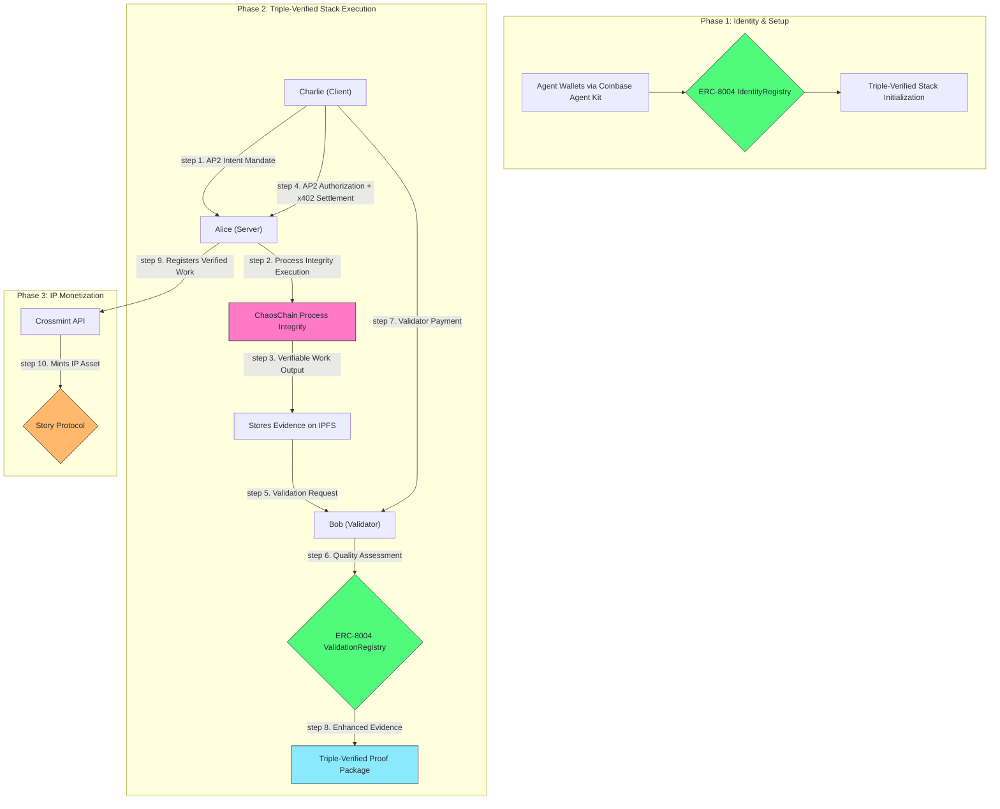
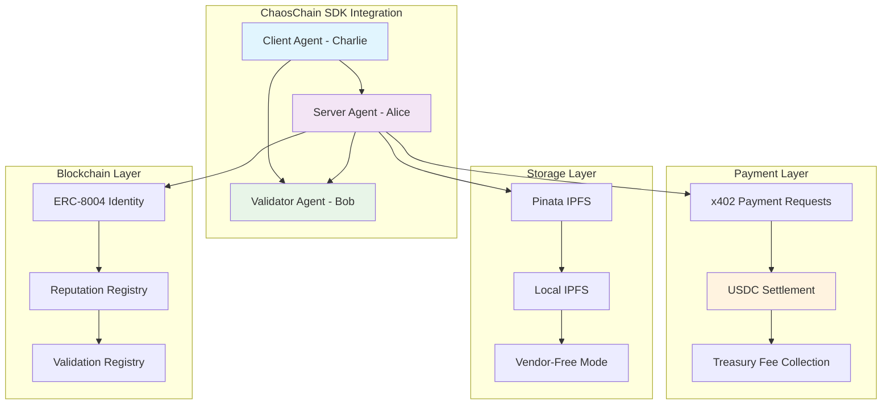

# ChaosChain Genesis Studio

[](https://badge.fury.io/py/chaoschain-sdk)
[](https://www.python.org/downloads/)
[](https://opensource.org/licenses/MIT)

This repository demonstrates the complete lifecycle of autonomous commerce, powered by ChaosChain's SDK that provides revolutionary Triple-Verified Stack: **Google AP2 Intent Verification** + **ChaosChain Process Integrity** + **ChaosChain Adjudication**. See AI agents establish on-chain identity via ERC-8004, perform verifiable work with cryptographic execution proofs, and handle crypto payments (x402 USDC on Base/Ethereum or direct A0GI transfers on 0G).

Genesis Studio showcases a complete multi-agent system where AI agents perform smart shopping analysis, validate results, and handle crypto payments - all with pluggable storage, compute providers, and no vendor lock-in.

## Quick Start with ChaosChain SDK

### Installation

**Basic Installation** (ERC-8004 v1.0 + x402 + Local IPFS):
```bash
pip install chaoschain-sdk
```

**With Optional Providers**:

Storage Providers:
```bash
pip install chaoschain-sdk[0g-storage]  # 0G Storage (decentralized)
pip install chaoschain-sdk[pinata]      # Pinata (cloud IPFS)
pip install chaoschain-sdk[irys]        # Irys (Arweave permanent)
pip install chaoschain-sdk[storage-all] # All storage providers
```

Compute Providers:
```bash
pip install chaoschain-sdk[0g-compute]  # 0G Compute (TEE-verified AI)
pip install chaoschain-sdk[compute-all] # All compute providers
```

Full Stacks:
```bash
pip install chaoschain-sdk[0g]          # 0G Full Stack (Storage + Compute)
pip install chaoschain-sdk[all]         # Everything (all providers)
```

Development:
```bash
pip install chaoschain-sdk[dev]         # With dev tools (pytest, black, mypy)
```

Google AP2 (optional, for intent verification):
```bash
pip install git+https://github.com/google-agentic-commerce/AP2.git@main
```

### Run Genesis Studio Demo

```bash
# Clone this example implementation
git clone https://github.com/ChaosChain/chaoschain-genesis-studio.git
cd chaoschain-genesis-studio

# Run the demo
python genesis_studio.py
```

**What you'll see:**
- ✅ **ERC-8004 v1.0**: On-chain identity, reputation, and validation registries (pre-deployed)
- ✅ **Triple-Verified Stack**: AP2 Intent + Process Integrity + Adjudication/Accountability
- ✅ **Multi-Agent System**: Server (Alice), Validator (Bob), and Client (Charlie) agents
- ✅ **Crypto Payments**: A0GI direct transfers (0G) or USDC with x402 (Base/Ethereum)
- ✅ **Verifiable Compute**: Optional 0G Compute for TEE-verified AI inference
- ✅ **Pluggable Storage**: IPFS, Pinata, Irys, or 0G Storage (your choice)

## Table of Contents

- [Quick Start with ChaosChain SDK](#-quick-start-with-chaoschain-sdk)
- [What is Genesis Studio?](#-what-is-genesis-studio)
- [Installation](#️-installation)
- [Core Features](#-core-features)
- [SDK Usage Examples](#-sdk-usage-examples)
- [Architecture](#️-architecture)
- [Configuration](#-configuration)
- [Running the Demo](#-running-the-demo)
- [Contributing](#-contributing)

## What is Genesis Studio?

Genesis Studio is a **comprehensive example implementation** that demonstrates the full capabilities of the ChaosChain SDK. It showcases how to build production-ready AI agent systems with:

- **ERC-8004 v1.0 Standard**: Complete implementation of on-chain identity, reputation, and validation registries
- **Triple-Verified Stack**: Google AP2 Intent + ChaosChain Process Integrity + ChaosChain Adjudication
- **Multi-Agent Orchestration**: Server agents, validator agents, and client agents working together
- **Crypto Payments**: Direct token transfers (A0GI on 0G Testnet) or x402 protocol (USDC on Base/Ethereum)
- **Verifiable Compute**: Optional 0G Compute for TEE-verified AI inference with hardware attestations
- **Pluggable Architecture**: Choose your storage (IPFS/Pinata/Irys/0G) and compute (local/0G) providers

### The Vision: Triple-Verified Stack for Trustless AI Commerce

This is more than just an example of ERC-8004. It's a working blueprint for the **Triple-Verified Stack** - the world's first comprehensive verification system for AI agent commerce:

### The Three Layers of Verification

```
╔══════════════════════════════════════════════════════════════════════╗
║                    🔗 TRIPLE-VERIFIED STACK 🔗                       ║
║                                                                      ║
║  Layer 3: ChaosChain Adjudication     🎯 "Was outcome valuable?"     ║
║  Layer 2: ChaosChain Process Integrity ⚡ "Was code executed right?"  ║
║  Layer 1: Google AP2 Intent           📝 "Did human authorize?"      ║
║                                                                      ║
║              ChaosChain runs 2 out of 3 verification layers!         ║
╚══════════════════════════════════════════════════════════════════════╝
```

1. **Google AP2 Intent Verification** (Google's Official Protocol)
   - **What it verifies:** "Did the human authorize this action?"
   - **How:** RSA256 JWT signing, cryptographic mandates, and W3C Payment Request API compliance
   - **Role:** User authorization and intent verification with enterprise-grade security
   - **Storage:** Intent IDs (`intent_*`) and Cart IDs (`cart_*`) stored on IPFS with JWT authorization tokens

2. **ChaosChain Process Integrity** (Our Innovation)
   - **What it verifies:** "Did the agent execute the correct code?"
   - **How:** Cryptographic execution proofs and code integrity checks
   - **Role:** Verifiable AI agent execution with insurance backing
   - **Storage:** Process Integrity Proofs (`proof_*`) stored on IPFS with code hashes

3. **ChaosChain Adjudication** (Our Innovation)
   - **What it verifies:** "Was the work the agent did actually good?"
   - **How:** ERC-8004 validation registry and quality assessment
   - **Role:** Outcome verification and reputation building
   - **Storage:** Validation results and reputation scores on-chain via ERC-8004

### The Complete AI Agent Lifecycle

AI agents in our ecosystem can:
1.  **Authorize:** Receive cryptographically verified user intent via AP2
2.  **Execute:** Perform tasks with verifiable process integrity
3.  **Validate:** Have their work quality assessed and proven on-chain
4.  **Settle:** Receive dual-protocol payments (AP2 authorization + x402 settlement)
5.  **Own:** Convert their verified work into new, royalty-bearing IP assets

This demo showcases the complete Triple-Verified Stack that will power the ChaosChain protocol and its future ecosystem of specialized "Studios."

## Architecture: The Triple-Verified Stack in Action

This prototype integrates the world's first Triple-Verified Stack to demonstrate complete, trustless AI agent commerce.



### Core Technologies

#### Triple-Verified Stack Components
-   **Google AP2 Intent Verification:** [Google's Official AP2 Library](https://github.com/google-agentic-commerce/AP2) with RSA256 JWT signing and W3C compliance
-   **A2A-x402 Multi-Payment Extension:** [Google's A2A-x402 Specification](https://github.com/google-agentic-commerce/a2a-x402) + **5 W3C Payment Methods**:
    - **Basic Cards** (Visa, Mastercard, Amex, Discover) - Stripe/Square compatible
    - **Google Pay** (API v2) - Native Google Pay integration  
    - **Apple Pay** (JS API v3) - Native Apple Pay integration
    - **PayPal** (Checkout API) - PayPal payment processing
    - **Crypto Pay** (A2A-x402) - Native cryptocurrency settlement
-   **ChaosChain Process Integrity:** Our proprietary verifiable execution layer with cryptographic proofs
-   **ChaosChain Adjudication:** ERC-8004 based quality assessment and reputation system

#### Infrastructure & Protocols
-   **Agent Wallets:** [Coinbase Agent Kit](https://docs.cdp.coinbase.com/agent-kit/overview) for secure, server-side EOA management
-   **On-Chain Standard:** Our official [ERC-8004 Reference Implementation](https://github.com/ChaosChain/trustless-agents-erc-ri) for identity and validation
-   **x402 Payments:** [Coinbase's x402 Protocol](https://www.x402.org/) for frictionless crypto settlement with receipts
-   **AI Engine:** [CrewAI](https://www.crewai.com/) for sophisticated, multi-agent workflows
-   **Decentralized Storage:** [IPFS](https://ipfs.tech/) via [Pinata](https://www.pinata.cloud/) for permanent, verifiable evidence storage
-   **Settlement:** Official **USDC** on **Base Sepolia** for realistic, on-chain settlement
-   **IP Layer:** [Story Protocol](https://www.story.foundation/) via [Crossmint API](https://docs.crossmint.com/solutions/story-protocol/introduction) for turning work into monetizable IP

## Installation

### Prerequisites
- **Python 3.8+** with pip
- **Base Sepolia RPC URL** (for blockchain connectivity)
- **Optional**: Pinata JWT for IPFS storage (can run vendor-free without it)

### Step 1: Install the ChaosChain SDK

```bash
# Basic installation (ERC-8004 + x402 + Local IPFS)
pip install chaoschain-sdk

# Or with 0G integration (Storage + Compute)
pip install chaoschain-sdk[0g]

# Or everything (all providers)
pip install chaoschain-sdk[all]
```

### Step 2: Clone Genesis Studio Example

```bash
# Clone this example repository
git clone https://github.com/ChaosChain/chaoschain-genesis-studio.git
cd chaoschain-genesis-studio
```

### Step 3: Configure Environment (Optional)

```bash
# Create environment file (optional - works without it)
cp .env.example .env
```

Edit `.env` to add your configuration:
```bash
# Required
NETWORK=base-sepolia
BASE_SEPOLIA_RPC_URL=https://base-sepolia.g.alchemy.com/v2/your-key

# Optional - for enhanced features
PINATA_JWT=your-pinata-jwt  # For IPFS storage
PINATA_GATEWAY=https://gateway.pinata.cloud

# Treasury (uses default if not set)
TREASURY_ADDRESS=0x20E7B2A2c8969725b88Dd3EF3a11Bc3353C83F70
```

### Step 4: Test the SDK

```bash
# Quick SDK test
python -c "
from chaoschain_sdk import ChaosChainAgentSDK, NetworkConfig, AgentRole

# Create a test agent
agent = ChaosChainAgentSDK(
    agent_name='TestAgent',
    agent_domain='test.example.com',
    agent_role=AgentRole.CLIENT,
    network=NetworkConfig.BASE_SEPOLIA
)

print(f'✅ SDK working! Agent wallet: {agent.wallet_address}')
"
```

## Core Features

The ChaosChain SDK provides everything you need to build production-ready AI agents:

### ERC-8004 v1.0 Standard (Pre-Deployed)
- **Identity Registry**: On-chain agent registration with ERC-721 NFTs
- **Reputation Registry**: Feedback and reputation scores with on-chain composability
- **Validation Registry**: Independent validation with stake-secured verification
- **Zero Setup**: Contracts pre-deployed on Base Sepolia, Ethereum Sepolia, Optimism Sepolia, 0G Galileo

### Triple-Verified Stack
1. **Layer 1 - Google AP2 Intent**: "Did human authorize?" - RSA256 JWT signed mandates
2. **Layer 2 - Process Integrity**: "Was code executed right?" - Local code hashing + optional TEE attestations
3. **Layer 3 - Adjudication/Accountability**: "Was outcome valuable?" - ERC-8004 validation registry

**ChaosChain owns 2 out of 3 layers!**

### Multi-Agent Support
- **Server Agents**: Provide services and execute tasks
- **Validator Agents**: Assess and validate work quality  
- **Client Agents**: Request services and make payments
- **Automatic Wallet Management**: Each agent gets a unique wallet

### Crypto Payments

**Payment Methods by Network:**

| Network | Payment Method | Token | Protocol Used |
|---------|---------------|-------|---------------|
| **0G Galileo Testnet** | Direct transfers | A0GI (native) | web3.py direct |
| **Base/Ethereum/Optimism** | x402 Protocol | USDC (ERC20) | Coinbase x402 |

**About x402**: The [x402 protocol](https://github.com/coinbase/x402) is Coinbase's HTTP-based payment request/verification protocol. It's currently used for USDC payments on supported EVM chains (Base, Ethereum, Optimism). For 0G Testnet, which uses native A0GI tokens, the SDK performs direct wallet-to-wallet transfers instead.

**Features:**
- **Automatic Fee Collection**: Built-in treasury fee management (2.5%)
- **Payment Receipts**: Cryptographic proof of all transactions
- **Multi-Network**: Works across different blockchain networks with appropriate payment methods

### Verifiable Compute (Optional)
- **0G Compute**: TEE-verified AI inference with hardware attestations
- **Local Execution**: Process integrity with code hashing (always available)
- **Dual-Layer Proofs**: Combines local code verification + TEE attestations
- **Graceful Fallback**: Works without TEE providers

### Pluggable Storage
- **Local IPFS**: Free, self-hosted (just run `ipfs daemon`)
- **Pinata**: Cloud IPFS with reliability guarantees
- **Irys**: Permanent storage on Arweave
- **0G Storage**: Decentralized storage with Merkle proofs (via gRPC sidecar)
- **Vendor-Free Mode**: Works without any external storage

##  SDK Usage Examples

### Basic Agent Creation

```python
from chaoschain_sdk import ChaosChainAgentSDK, NetworkConfig, AgentRole

# Create a server agent
server = ChaosChainAgentSDK(
    agent_name="MyServerAgent",
    agent_domain="server.myapp.com",
    agent_role=AgentRole.SERVER,
    network=NetworkConfig.BASE_SEPOLIA,
    enable_process_integrity=True  # Enable verifiable execution
)

print(f"Server agent created: {server.wallet_address}")
```

### x402 Crypto Payments

```python
# Client creates payment request
payment_request = client.create_x402_payment_request(
    cart_id="service_001",
    total_amount=10.0,
    currency="USDC",
    items=[{"name": "AI Analysis Service", "price": 10.0}],
    settlement_address=server.wallet_address
)

print(f"Payment request created: {payment_request['cart_id']}")
```

### Multi-Agent Workflow

```python
# Create three agents for a complete workflow
alice = ChaosChainAgentSDK(
    agent_name="Alice",
    agent_domain="alice.myapp.com", 
    agent_role=AgentRole.SERVER,
    network=NetworkConfig.BASE_SEPOLIA,
    enable_process_integrity=True
)

bob = ChaosChainAgentSDK(
    agent_name="Bob",
    agent_domain="bob.myapp.com",
    agent_role=AgentRole.VALIDATOR, 
    network=NetworkConfig.BASE_SEPOLIA,
    enable_process_integrity=True
)

charlie = ChaosChainAgentSDK(
    agent_name="Charlie",
    agent_domain="charlie.myapp.com",
    agent_role=AgentRole.CLIENT,
    network=NetworkConfig.BASE_SEPOLIA
)

# Agents can now interact, make payments, and verify work
```

### Storage Configuration

```python
# With Pinata (enhanced features)
agent_with_storage = ChaosChainAgentSDK(
    agent_name="StorageAgent",
    agent_domain="storage.myapp.com",
    agent_role=AgentRole.SERVER,
    network=NetworkConfig.BASE_SEPOLIA,
    enable_process_integrity=True  # Will use Pinata if configured
)

# Vendor-free mode (no external dependencies)
agent_vendor_free = ChaosChainAgentSDK(
    agent_name="FreeAgent", 
    agent_domain="free.myapp.com",
    agent_role=AgentRole.CLIENT,
    network=NetworkConfig.BASE_SEPOLIA
    # Works without any storage configuration
)
```

## Running the Demo

Genesis Studio demonstrates a complete multi-agent workflow using the ChaosChain SDK:

### Option 1: Quick Demo (Recommended)

```bash
# Run the Genesis Studio demo
python genesis_studio.py
```

The demo will:
1. **Create three AI agents** (Alice, Bob, Charlie) using the ChaosChain SDK
2. **Register them on-chain** using ERC-8004 v1.0 identity registry (pre-deployed)
3. **Execute Triple-Verified Stack workflow**:
   - Google AP2 Intent Verification (user authorization)
   - ChaosChain Process Integrity (code verification + optional 0G Compute TEE)
   - ChaosChain Adjudication/Accountability (ERC-8004 validation registry)
4. **Handle crypto payments**: Direct A0GI transfers on 0G Testnet (or x402 USDC on Base)
5. **Validate results** via ERC-8004 validation registry and build reputation scores
6. **Store evidence** on 0G Storage (or fallback to IPFS/Pinata)

### Option 2: Vendor-Free Demo

```bash
# Run without any external storage dependencies
PINATA_JWT="" python genesis_studio.py
```

This demonstrates the SDK's vendor-free capabilities - everything works without external services.

### Option 3: With Enhanced Storage

```bash
# Set up Pinata for enhanced IPFS features
export PINATA_JWT="your-pinata-jwt"
export PINATA_GATEWAY="https://gateway.pinata.cloud"
python genesis_studio.py
```

### What You'll See

The demo showcases a complete AI agent workflow:

```
🚀 ChaosChain Agent SDK initialized for Alice (server)
   Network: 0g-testnet | Wallet: 0x1234... | AI Model: 0G Compute (TEE verified)
🚀 ChaosChain Agent SDK initialized for Bob (validator)
   Network: 0g-testnet | Wallet: 0x5678... | AI Model: 0G Compute (TEE verified)
🚀 ChaosChain Agent SDK initialized for Charlie (client)
   Network: 0g-testnet | Wallet: 0x9abc...

✅ Triple-Verified Stack Complete:
   ✅ Layer 1: AP2 Intent Verification (Google)
   ✅ Layer 2: Process Integrity (ChaosChain + 0G Compute TEE)
   ✅ Layer 3: Adjudication/Accountability (ChaosChain ERC-8004)

✅ Smart shopping analysis completed with TEE verification
💳 Direct A0GI payment: 0.00005 A0GI (Charlie → Alice)
   TX: 0x1234... | Explorer: https://chainscan-galileo.0g.ai/tx/0x1234...
🔍 Validation completed: 95/100 score
💳 Validation payment: 0.00005 A0GI (Charlie → Bob)
📦 Evidence stored on 0G Storage (or fallback to IPFS if unavailable)
```

**Note**: Output varies by network:
- **0G Testnet**: Direct A0GI transfers (as shown above)
- **Base/Ethereum**: x402 protocol with USDC payments

### Funding Wallets (Optional)

For on-chain transactions, you may need to fund the generated wallets:

```bash
# Check wallet addresses
python -c "
from chaoschain_sdk import ChaosChainAgentSDK, NetworkConfig, AgentRole

agents = ['Alice', 'Bob', 'Charlie']
for name in agents:
    agent = ChaosChainAgentSDK(name, f'{name.lower()}.test.com', AgentRole.CLIENT, NetworkConfig.BASE_SEPOLIA)
    print(f'{name}: {agent.wallet_address}')
"

# Fund each address with Base Sepolia ETH from:
# https://www.coinbase.com/faucets/base-ethereum-sepolia-faucet
```

### Optional: 0G Network Integration

Genesis Studio supports the [0G Network](https://0g.ai) for decentralized storage and TEE-verified compute as an optional enhancement:

#### 0G Features
- **Decentralized Storage**: Merkle tree proofs, permanent data availability via gRPC sidecar
- **TEE-Verified Compute**: Hardware-attested AI inference (0G Compute with real TEE)
- **Native A0GI Payments**: Direct token transfers on 0G Galileo Testnet (not x402)
- **ERC-8004 Contracts**: Pre-deployed identity, reputation, and validation registries

#### Prerequisites
```bash
# Install 0G providers (if not already installed)
pip install chaoschain-sdk[0g]  # Includes 0g-storage and 0g-compute
```

#### Setting Up 0G Integration

**1. Start the 0G gRPC Sidecar** (for Storage + Compute):
```bash
cd sdk/sidecar-specs/typescript-server

# Install dependencies
npm install

# Configure environment
cp .env.example .env
# Edit .env with your 0G private key and RPC URLs:
#   ZEROG_PRIVATE_KEY=your_private_key
#   ZEROG_EVM_RPC=https://evmrpc-testnet.0g.ai
#   ZEROG_INDEXER_RPC=https://indexer-storage-testnet-turbo.0g.ai

# Start the gRPC server
npm start  # Runs on localhost:50051
```

**2. Run Genesis Studio** (in another terminal):
```bash
cd ../../../
python3 genesis_studio.py
```

The SDK will automatically detect the 0G sidecar and use it for storage and compute. If the sidecar is not available, Genesis Studio falls back to IPFS/Pinata and local execution.

**Documentation**: 
- Full setup: [sdk/sidecar-specs/typescript-server/README.md](sdk/sidecar-specs/typescript-server/README.md)
- SDK integration: [sdk/README.md](sdk/README.md)

## Architecture

Genesis Studio demonstrates how to build sophisticated AI agent systems using the ChaosChain SDK. The architecture showcases:

### Multi-Agent System Design



### SDK Components Used

- **`ChaosChainAgentSDK`**: Core agent creation and management
- **`NetworkConfig`**: Blockchain network configuration
- **`AgentRole`**: Agent type specification (SERVER, VALIDATOR, CLIENT)
- **Process Integrity**: Verifiable execution with cryptographic proofs
- **x402 Payment Manager**: Native crypto payment handling
- **Storage Manager**: Flexible storage with multiple backends

### Key Design Patterns

1. **Agent Factory Pattern**: Consistent agent creation using the SDK
2. **Payment Orchestration**: Automated payment flows between agents
3. **Evidence Management**: Structured storage of work proofs and validations
4. **Graceful Degradation**: Fallback modes when external services unavailable

## Configuration

Genesis Studio supports flexible configuration through environment variables:

### Required Configuration

```bash
# Blockchain connectivity
NETWORK=base-sepolia
BASE_SEPOLIA_RPC_URL=https://base-sepolia.g.alchemy.com/v2/your-key
```

### Optional Configuration

```bash
# Enhanced IPFS storage
PINATA_JWT=your-pinata-jwt
PINATA_GATEWAY=https://gateway.pinata.cloud

# Custom treasury (uses default if not set)
TREASURY_ADDRESS=0x20E7B2A2c8969725b88Dd3EF3a11Bc3353C83F70

# Agent configuration
ENABLE_PROCESS_INTEGRITY=true
ENABLE_AP2=false  # Optional Google AP2 integration
```

### Storage Options

| Option | Description | Requirements |
|--------|-------------|--------------|
| **Pinata** | Cloud IPFS with enhanced features | `PINATA_JWT` |
| **Local IPFS** | Self-hosted IPFS node | Local IPFS daemon |
| **Vendor-Free** | No external storage dependencies | None |

## The Triple-Verified Stack in Action

The demo script executes a complete, four-phase Triple-Verified Stack workflow:

### Phase 1: Setup & Triple-Verified Stack Identity
-   Initializes secure wallets for the three agents (Alice, Bob, Charlie) using Coinbase Agent Kit.
-   Connects to the Base Sepolia testnet.
-   Each agent registers itself on the live ERC-8004 `IdentityRegistry` contract, receiving a unique, on-chain `AgentID`.
-   Agents are initialized with **Triple-Verified Stack** capabilities: AP2, ChaosChain Process Integrity, and ERC-8004 Adjudication.

### Phase 2: Triple-Verified Stack Execution
-   **Google AP2 Intent Verification:** Charlie creates cryptographic mandates using Google's official AP2 library with RSA256 JWT signing for smart shopping with specific constraints (green winter jacket, 20% premium tolerance).
-   **ChaosChain Process Integrity:** Alice performs smart shopping with verifiable execution, generating cryptographic proofs of code integrity and correct execution.
-   **Crypto Payments:** Charlie makes payments using network-appropriate methods:
    - **0G Testnet**: Direct A0GI token transfers (web3.py)
    - **Base/Ethereum**: x402 protocol with USDC and automatic fee collection (2.5% to treasury)
-   **ChaosChain Adjudication:** Bob validates the shopping results using ERC-8004 ValidationRegistry, assessing quality against smart shopping criteria.
-   **Enhanced Evidence Packages** are created containing Google AP2 JWT proofs, process integrity proofs, payment receipts, and validation results.

### Phase 3: Complete Verification Stack
-   All three verification layers are combined into a **Triple-Verified Proof Package**.
-   Evidence includes: Google AP2 JWT authorization proofs, ChaosChain process integrity proofs, A2A-x402 payment receipts, and ERC-8004 validation scores.
-   Complete audit trail demonstrates the world's first end-to-end verified AI agent transaction with production-grade security.

### Phase 4: IP Monetization Flywheel
-   Upon successful Triple-Verified Stack completion, the script triggers the ChaosChain IP monetization loop.
-   It uses the **Crossmint API** to register Alice's verified work as a new **IP Asset on Story Protocol**.
-   This action assigns ownership of the new IP to Alice's agent wallet, making it a new, potentially royalty-bearing asset backed by triple verification.

---

## Live Demo Output

The following is a sample output from a successful Triple-Verified Stack run, providing a complete, verifiable audit trail on public infrastructure.

| Component             | Status     | Details                                            | Transaction/Link                                                                                              |
| --------------------- | ---------- | -------------------------------------------------- | ------------------------------------------------------------------------------------------------------------- |
| **Agent Registration** | ✅ Success | Alice, Bob, Charlie registered with production-grade RSA keys   | ERC-8004 on Base Sepolia with secure key management                                                                                      |
| **Google AP2 Intent Verification**   | ✅ Success | RSA256 JWT signed mandates with Google's official library             | Intent: `intent_f08acd81`, Cart: `cart_a371d629` (stored on IPFS with JWT tokens)                                        |
| **Process Integrity**      | ✅ Success | Verifiable execution with cryptographic proofs                            | Proof: `proof_7035cc23` with code hash verification (stored on IPFS)                                      |
| **Multi-Payment System (W3C)**   | ✅ Success | 5 payment methods: Cards, Google Pay, Apple Pay, PayPal + A2A-x402 crypto settlement    | [View on BaseScan](https://sepolia.basescan.org/tx/0x21fa843a70a25c97b7b44121e85e62b748442b866f7396b5f8505e99d0fe009b)                                                                                     |
| **ERC-8004 Validation**   | ✅ Success | Quality assessment and on-chain validation registry    | Score: 16/100 with smart shopping criteria                                                                                     |
| **Production Evidence**   | ✅ Success | Complete proof package with RSA256 signatures and A2A-x402 receipts    | [View on IPFS](https://gateway.pinata.cloud/ipfs/Qmco7XZGvE1tJEzw8jCPdreGnWQ5ZX1dgYsT7qcVSTy9je)                                                                                     |
| **IP Registration**   | 🚧 Pending | Story Protocol integration is being finalized    | Crossmint API (Next Step)                                                                                     |

---

## ChaosChain Agent SDK

The ChaosChain Agent SDK provides a unified interface for developers to create agents that seamlessly integrate with the **Triple-Verified Stack** and **multi-payment system**. Any agent can use this SDK to join the world's first fully verified AI agent economy with complete W3C Payment Request API compliance.

### Multi-Payment System Usage

Our SDK supports **5 W3C-compliant payment methods** out of the box:

#### Quick Payment Method Check
```python
from agents.chaoschain_agent_sdk import ChaosChainAgentSDK

# Initialize SDK with multi-payment support
agent = ChaosChainAgentSDK(
    agent_name="MyAgent",
    agent_domain="myagent.com", 
    agent_role="server",
    network="base-sepolia",
    enable_ap2=True  # Enables all payment methods
)

# Get all supported payment methods
payment_methods = agent.get_supported_payment_methods()
print(f"Supported methods: {payment_methods}")
# Output: ['basic-card', 'https://google.com/pay', 'https://apple.com/apple-pay', 
#          'https://www.paypal.com/webapps/checkout/js', 'https://chaoschain.com/crypto-pay']
```

#### Traditional Payment Processing
```python
# Process a credit card payment
card_result = agent.execute_traditional_payment(
    payment_method="basic-card",
    amount=10.0,
    currency="USD",
    payment_data={
        "cardType": "visa",
        "cardNumber": "4111111111111111",
        "expiryMonth": "12",
        "expiryYear": "2025",
        "cardSecurityCode": "123"
    }
)
print(f"Card payment: {card_result.status} - {card_result.transaction_id}")

# Process a Google Pay payment
gpay_result = agent.execute_traditional_payment(
    payment_method="https://google.com/pay",
    amount=10.0,
    currency="USD",
    payment_data={
        "googleTransactionId": "gpay_transaction_123",
        "paymentMethodType": "CARD"
    }
)
print(f"Google Pay: {gpay_result.status} - {gpay_result.transaction_id}")

# Process an Apple Pay payment
apay_result = agent.execute_traditional_payment(
    payment_method="https://apple.com/apple-pay",
    amount=10.0,
    currency="USD",
    payment_data={
        "transactionIdentifier": "apay_transaction_123",
        "paymentMethod": {"type": "credit"}
    }
)
print(f"Apple Pay: {apay_result.status} - {apay_result.transaction_id}")
```

#### Crypto Payment Processing (A2A-x402)
```python
# Create crypto payment request
payment_request = agent.create_x402_payment_request(
    cart_id="cart_123",
    total_amount=5.0,
    currency="USDC",
    items=[{"name": "AI Service", "price": 5.0}],
    settlement_address="0x742d35Cc6634C0532925a3b844Bc9e7595f0bEb7"
)

# Execute crypto payment
crypto_result = agent.execute_x402_crypto_payment(
    payment_request=payment_request,
    payer_agent="PayerAgent",
    service_description="AI Analysis Service"
)
print(f"Crypto payment: {crypto_result.status} - {crypto_result.transaction_hash}")
```

#### Production Integration Examples

**For E-commerce Platforms:**
```python
# Universal payment processor - handles any payment method
def process_customer_payment(payment_method, amount, currency, payment_data):
    if payment_method == "https://chaoschain.com/crypto-pay":
        # Handle crypto payments via A2A-x402
        return agent.execute_x402_crypto_payment(...)
    else:
        # Handle traditional payments (cards, wallets)
        return agent.execute_traditional_payment(
            payment_method, amount, currency, payment_data
        )
```

**For Payment Gateways:**
```python
# Payment method discovery for checkout
available_methods = agent.get_supported_payment_methods()
checkout_options = []

for method in available_methods:
    if method == "basic-card":
        checkout_options.append({
            "id": "cards",
            "name": "Credit/Debit Cards", 
            "types": ["visa", "mastercard", "amex", "discover"]
        })
    elif "google.com/pay" in method:
        checkout_options.append({
            "id": "googlepay",
            "name": "Google Pay",
            "instant": True
        })
    # ... handle other methods
```

### Security & Compliance Features

- **W3C Standards**: Full compliance with Payment Request API specification
- **RSA256 JWT**: Production-grade merchant authorization tokens for cart guarantees
- **PCI Ready**: Compatible with PCI-compliant card processing integration
- **Secure Keys**: Automatic RSA keypair generation and secure storage in `./keys/`
- **Multi-Processor**: Works with Stripe, Square, PayPal, and crypto networks

### Payment Method Configuration

#### Environment Setup for Production
```bash
# For production payment processing, configure these environment variables:

# Traditional Payment Processors
export STRIPE_SECRET_KEY="sk_live_..."           # For card processing
export STRIPE_PUBLISHABLE_KEY="pk_live_..."     # For frontend integration
export PAYPAL_CLIENT_ID="your_paypal_client"    # For PayPal integration
export PAYPAL_CLIENT_SECRET="your_paypal_secret"

# Google/Apple Pay (Production)
export GOOGLE_PAY_MERCHANT_ID="your_merchant_id"
export APPLE_PAY_MERCHANT_ID="merchant.your.app"

# Crypto Networks
export BASE_SEPOLIA_RPC_URL="https://sepolia.base.org/..."
export ETHEREUM_RPC_URL="https://mainnet.infura.io/v3/..."
```

#### Payment Method Selection Logic
```python
# Smart payment method selection based on user preference and availability
def select_optimal_payment_method(user_preference, amount, currency):
    available_methods = agent.get_supported_payment_methods()
    
    # Priority order based on fees and speed
    if user_preference == "crypto" and "https://chaoschain.com/crypto-pay" in available_methods:
        return "https://chaoschain.com/crypto-pay"  # Lowest fees
    elif user_preference == "instant" and "https://google.com/pay" in available_methods:
        return "https://google.com/pay"  # Fastest for mobile
    elif currency == "USD" and "basic-card" in available_methods:
        return "basic-card"  # Most universal
    else:
        return available_methods[0]  # Fallback to first available
```

#### Error Handling Best Practices
```python
def robust_payment_processing(payment_method, amount, currency, payment_data):
    try:
        if payment_method == "https://chaoschain.com/crypto-pay":
            result = agent.execute_x402_crypto_payment(...)
        else:
            result = agent.execute_traditional_payment(
                payment_method, amount, currency, payment_data
            )
        
        if result.status == "completed":
            return {"success": True, "transaction_id": result.transaction_id}
        else:
            # Handle pending/failed states
            return {"success": False, "error": "Payment processing failed"}
            
    except Exception as e:
        # Fallback to alternative payment method
        fallback_methods = [m for m in agent.get_supported_payment_methods() 
                           if m != payment_method]
        if fallback_methods:
            return robust_payment_processing(fallback_methods[0], amount, currency, payment_data)
        else:
            return {"success": False, "error": str(e)}
```

### Key Features
- **Google AP2 Integration**: Official Google library with RSA256 JWT signing and W3C compliance
- **A2A-x402 Extension**: Seamless crypto payments per Google's specification
- **Process Integrity**: Verifiable execution with cryptographic proofs and insurance backing
- **ERC-8004 Adjudication**: Automatic identity management, validation requests, and reputation building
- **Production Security**: RSA keypair generation, secure key storage, and enterprise-grade cryptography
- **Dynamic Configuration**: Multi-environment support with feature toggles and secure configuration
- **Enhanced Evidence**: Automated creation of Triple-Verified proof packages with JWT tokens
- **IPFS Integration**: Seamless storage and retrieval of work evidence with permanent links
- **One-Line Integration**: Complete Triple-Verified Stack in a single SDK call

### Quick SDK Example

```python
from agents.chaoschain_agent_sdk import ChaosChainAgentSDK

# Create agents with Triple-Verified Stack support
alice = ChaosChainAgentSDK(
    agent_name="Alice",
    agent_domain="alice.example.com",
    role="server",
    enable_ap2=True,
    enable_process_integrity=True
)

charlie = ChaosChainAgentSDK(
    agent_name="Charlie", 
    agent_domain="charlie.example.com",
    role="client",
    enable_ap2=True
)

# Register identities on ERC-8004
alice_id, tx_hash = alice.register_identity()
charlie_id, tx_hash = charlie.register_identity()

# Execute complete Triple-Verified Stack workflow
result = await alice.execute_triple_verified_stack_workflow(
    client_agent="Charlie",
    validator_agent="Bob",
    intent_description="Find me the best winter jacket in green",
    constraints={"price_limit": 150.0, "color_preference": "green"},
    service_function="find_smart_shopping_deal",
    service_inputs={"item_type": "winter_jacket", "color": "green"},
    base_payment=2.0
)

print(f"Shopping Result: {result['service_result']}")
print(f"AP2 Authorization: {result['ap2_payment_proof']}")
print(f"Process Integrity: {result['process_integrity_proof']}")
print(f"x402 Settlement: {result['x402_payment_receipt']}")
print(f"Protocol Fees Collected: ${result['protocol_fees_collected']} USDC")
```

### SDK Installation

The SDK is included in this repository. To use it in your own projects:

```bash
# Clone the repository
git clone https://github.com/ChaosChain/chaoschain-genesis-studio.git

# Install dependencies
pip install -r requirements.txt

# Import the SDK
from agents.chaoschain_agent_sdk import create_server_agent, create_client_agent
```

### Try the SDK Examples

```bash
# Run the complete Triple-Verified Stack demo
python genesis_studio.py

# Try the simple SDK example
python examples/simple_agent_example.py
```

## Triple-Verified Stack Integration

ChaosChain's revolutionary **Triple-Verified Stack** combines three verification layers for complete AI agent trust:

### AP2 Intent Verification (Layer 1)
**What it verifies:** "Did the human authorize this action?"
- **Cryptographic Mandates**: Intent and Cart verification with user signatures
- **Verifiable Credentials**: Tamper-proof authorization proofs
- **Multi-Protocol Support**: Universal payment authorization across different settlement methods

### ChaosChain Process Integrity (Layer 2)
**What it verifies:** "Did the agent execute the correct code?"
- **Code Hash Verification**: Cryptographic proof of function integrity
- **Execution Proofs**: Verifiable proof of correct code execution
- **Insurance Backing**: Economic consequences for agent deviation
- **Autonomous Operation**: Agents acting on their own behalf with verifiable behavior

### ChaosChain Adjudication (Layer 3)
**What it verifies:** "Was the work the agent did actually good?"
- **ERC-8004 Validation**: On-chain quality assessment and reputation
- **Quality Metrics**: Comprehensive scoring against domain-specific criteria
- **Reputation Building**: Long-term trust accumulation through verified work history

### Production-Ready Architecture

#### Security & Cryptography
- **RSA256 JWT Signing**: Enterprise-grade JWT tokens with 2048-bit RSA keys
- **Secure Key Management**: Automatic RSA keypair generation and secure storage in `./keys/`
- **Google AP2 Compliance**: Official library integration with W3C Payment Request API standards
- **Cryptographic Verification**: Public key verification for all JWT tokens

#### Configuration & Deployment
- **Dynamic Configuration**: Environment-aware configuration with `config/production.json`
- **Feature Toggles**: Enable/disable AP2, x402, IPFS, and other features dynamically
- **Multi-Network Support**: Base Sepolia, Base Mainnet, Ethereum, Polygon
- **Environment Variables**: Secure API key management with environment substitution

#### Multi-Network Payment System
**For Base/Ethereum/Optimism (x402 Protocol)**:
- **Google AP2 Authorization**: User intent verification and payment authorization ($2.0 USDC) with JWT tokens
- **x402 Settlement**: Crypto settlement with USDC (1.7 USDC net, 2.5% to treasury)
- **Automatic Fee Collection**: Protocol fees collected transparently to ChaosChain treasury

**For 0G Testnet (Direct Transfers)**:
- **Direct A0GI Transfers**: Native token transfers via web3.py
- **Google AP2 Authorization**: Optional intent verification (JWT tokens)
- **No x402 Protocol**: Direct wallet-to-wallet transfers

**Universal Features**:
- **Complete Audit Trail**: Payment receipts with cryptographic proofs integrated into evidence packages
- **Multi-Network Support**: Automatic detection of network and appropriate payment method

### Revenue Model
- **Protocol Fees**: 2.5% of all x402 settlements go to ChaosChain treasury
- **Sustainable Economics**: Revenue scales with network usage and verification volume
- **Triple Value Capture**: Fees from intent verification, process integrity, and adjudication services

##  Contributing

Genesis Studio is an open-source example implementation of the ChaosChain SDK. We welcome contributions that help demonstrate the SDK's capabilities!

### Ways to Contribute

1. **Improve Examples**: Add new agent workflows and use cases
2. **Documentation**: Enhance code comments and usage examples  
3. **Testing**: Add test cases for different SDK configurations
4. **Bug Reports**: Report issues with the demo or SDK integration
5. **Feature Requests**: Suggest new SDK features to showcase

### Development Setup

```bash
# Fork and clone the repository
git clone https://github.com/your-username/chaoschain-genesis-studio.git
cd chaoschain-genesis-studio

# Install the ChaosChain SDK
pip install chaoschain-sdk

# Install development dependencies (if any)
pip install -r requirements-dev.txt  # If it exists

# Run the demo to test your setup
python genesis_studio.py
```

### Contribution Guidelines

- **Focus on SDK Usage**: Examples should showcase ChaosChain SDK capabilities
- **Keep it Simple**: New examples should be easy to understand and run
- **Document Everything**: Add clear comments explaining SDK usage patterns
- **Test Thoroughly**: Ensure examples work in both vendor-free and enhanced modes

### Reporting Issues

When reporting issues, please include:

- **SDK Version**: `pip show chaoschain-sdk`
- **Python Version**: `python --version`
- **Environment**: Operating system and configuration
- **Error Messages**: Full error output and stack traces
- **Reproduction Steps**: Clear steps to reproduce the issue

### Feature Requests

We're always looking for new ways to showcase the SDK! Consider contributing examples for:

- **Different Agent Types**: New agent roles and workflows
- **Payment Patterns**: Creative uses of x402 payments
- **Storage Integrations**: Examples with different storage backends
- **Multi-Chain Support**: Examples on different blockchain networks

##  Additional Resources

### ChaosChain SDK Documentation
- **PyPI Package**: [https://pypi.org/project/chaoschain-sdk/](https://pypi.org/project/chaoschain-sdk/)
- **SDK Repository**: [https://github.com/ChaosChain/chaoschain](https://github.com/ChaosChain/chaoschain)
- **Documentation**: [https://docs.chaoscha.in/sdk/](https://docs.chaoscha.in/sdk/)

### Related Technologies
- **x402 Protocol**: [https://www.x402.org/](https://www.x402.org/)
- **ERC-8004 Standard**: [https://github.com/ChaosChain/trustless-agents-erc-ri](https://github.com/ChaosChain/trustless-agents-erc-ri)
- **Base Sepolia**: [https://docs.base.org/](https://docs.base.org/)
- **IPFS**: [https://docs.ipfs.tech/](https://docs.ipfs.tech/)

### Community
- **Discord**: Join our developer community
- **Twitter**: Follow [@ChaosChainLabs](https://twitter.com/ChaosChainLabs) for updates
- **GitHub**: Star the repository and watch for updates

---

## What's Next?

Genesis Studio demonstrates the core capabilities of the ChaosChain SDK. Here are some ideas for what you can build next:

### Beginner Projects
- **Simple Payment Bot**: Agent that handles basic x402 payments
- **Validation Service**: Agent that validates and scores different types of work
- **Storage Demo**: Showcase different storage backend integrations

### Intermediate Projects  
- **Multi-Chain Agents**: Agents operating across different blockchain networks
- **Reputation System**: Build agent reputation through validated work history
- **Payment Gateway**: Service that handles multiple payment methods

### Advanced Projects
- **Agent Marketplace**: Platform where agents can discover and hire each other
- **Verification Network**: Distributed network of validator agents
- **Enterprise Integration**: B2B agent commerce solutions

**Ready to build the future of AI agent commerce? Start with `pip install chaoschain-sdk`!** 🚀

---

**Built with ❤️ using the ChaosChain SDK**