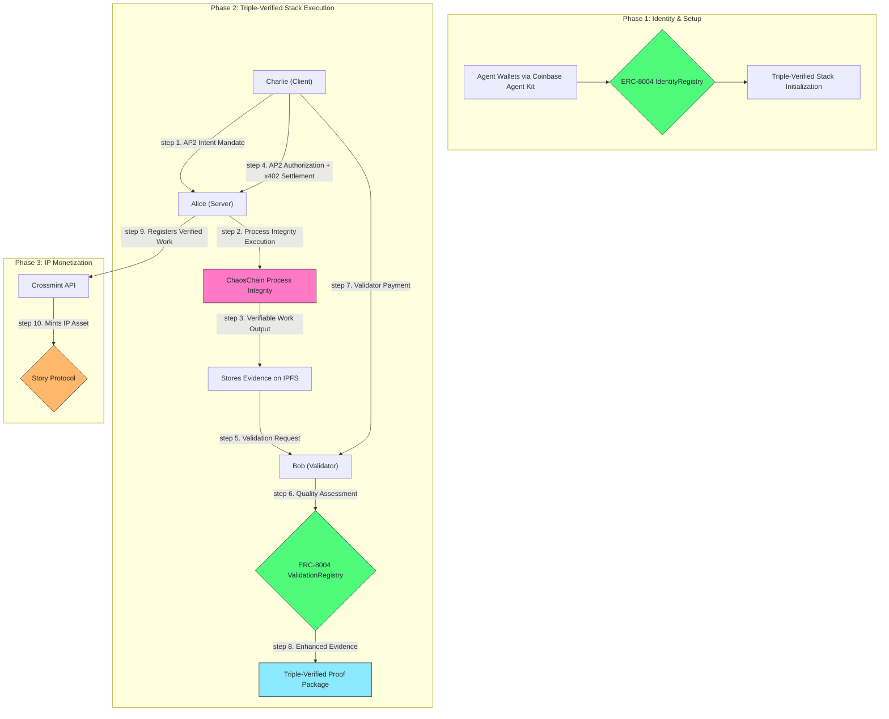

# ChaosChain Genesis Studio

**The world's first production ready Triple-Verified Stack for trustless AI agent commerce.**

This repository demonstrates the complete lifecycle of autonomous commerce, powered by ChaosChain's revolutionary Triple-Verified Stack: **Google AP2 Intent Verification** + **ChaosChain Process Integrity** + **ChaosChain Adjudication**. See AI agents establish on-chain identity via ERC-8004, perform verifiable work with cryptographic execution proofs, receive dual-protocol payments (AP2 + A2A-x402), and create monetizable IP assets.

**Production-Ready Features:**
- **RSA256 JWT Signing** for enterprise-grade security
- **Google's Official AP2 Library** with real cryptographic verification
- **A2A-x402 Extension** for seamless crypto payments
- **Dynamic Configuration** for multi-environment deployment
- **Secure Key Management** with automatic RSA keypair generation

**ChaosChain owns 2 out of 3 verification layers in the stack!**


## The Vision: Triple-Verified Stack for Trustless AI Commerce

This is more than just an example of ERC-8004. It's a working blueprint for the **Triple-Verified Stack** - the world's first comprehensive verification system for AI agent commerce:

### The Three Layers of Verification

```
╔══════════════════════════════════════════════════════════════════════╗
║                    🔗 TRIPLE-VERIFIED STACK 🔗                       ║
║                                                                      ║
║  Layer 3: ChaosChain Adjudication     🎯 "Was outcome valuable?"     ║
║  Layer 2: ChaosChain Process Integrity ⚡ "Was code executed right?"  ║
║  Layer 1: Google AP2 Intent           📝 "Did human authorize?"      ║
║                                                                      ║
║              ChaosChain runs 2 out of 3 verification layers!         ║
╚══════════════════════════════════════════════════════════════════════╝
```

1. **Google AP2 Intent Verification** (Google's Official Protocol)
   - **What it verifies:** "Did the human authorize this action?"
   - **How:** RSA256 JWT signing, cryptographic mandates, and W3C Payment Request API compliance
   - **Role:** User authorization and intent verification with enterprise-grade security
   - **Storage:** Intent IDs (`intent_*`) and Cart IDs (`cart_*`) stored on IPFS with JWT authorization tokens

2. **ChaosChain Process Integrity** (Our Innovation)
   - **What it verifies:** "Did the agent execute the correct code?"
   - **How:** Cryptographic execution proofs and code integrity checks
   - **Role:** Verifiable AI agent execution with insurance backing
   - **Storage:** Process Integrity Proofs (`proof_*`) stored on IPFS with code hashes

3. **ChaosChain Adjudication** (Our Innovation)
   - **What it verifies:** "Was the work the agent did actually good?"
   - **How:** ERC-8004 validation registry and quality assessment
   - **Role:** Outcome verification and reputation building
   - **Storage:** Validation results and reputation scores on-chain via ERC-8004

### The Complete AI Agent Lifecycle

AI agents in our ecosystem can:
1.  **Authorize:** Receive cryptographically verified user intent via AP2
2.  **Execute:** Perform tasks with verifiable process integrity
3.  **Validate:** Have their work quality assessed and proven on-chain
4.  **Settle:** Receive dual-protocol payments (AP2 authorization + x402 settlement)
5.  **Own:** Convert their verified work into new, royalty-bearing IP assets

This demo showcases the complete Triple-Verified Stack that will power the ChaosChain protocol and its future ecosystem of specialized "Studios."

## Architecture: The Triple-Verified Stack in Action

This prototype integrates the world's first Triple-Verified Stack to demonstrate complete, trustless AI agent commerce.



### Core Technologies

#### Triple-Verified Stack Components
-   **Google AP2 Intent Verification:** [Google's Official AP2 Library](https://github.com/google-agentic-commerce/AP2) with RSA256 JWT signing and W3C compliance
-   **A2A-x402 Multi-Payment Extension:** [Google's A2A-x402 Specification](https://github.com/google-agentic-commerce/a2a-x402) + **5 W3C Payment Methods**:
    - **Basic Cards** (Visa, Mastercard, Amex, Discover) - Stripe/Square compatible
    - **Google Pay** (API v2) - Native Google Pay integration  
    - **Apple Pay** (JS API v3) - Native Apple Pay integration
    - **PayPal** (Checkout API) - PayPal payment processing
    - **Crypto Pay** (A2A-x402) - Native cryptocurrency settlement
-   **ChaosChain Process Integrity:** Our proprietary verifiable execution layer with cryptographic proofs
-   **ChaosChain Adjudication:** ERC-8004 based quality assessment and reputation system

#### Infrastructure & Protocols
-   **Agent Wallets:** [Coinbase Agent Kit](https://docs.cdp.coinbase.com/agent-kit/overview) for secure, server-side EOA management
-   **On-Chain Standard:** Our official [ERC-8004 Reference Implementation](https://github.com/ChaosChain/trustless-agents-erc-ri) for identity and validation
-   **x402 Payments:** [Coinbase's x402 Protocol](https://www.x402.org/) for frictionless crypto settlement with receipts
-   **AI Engine:** [CrewAI](https://www.crewai.com/) for sophisticated, multi-agent workflows
-   **Decentralized Storage:** [IPFS](https://ipfs.tech/) via [Pinata](https://www.pinata.cloud/) for permanent, verifiable evidence storage
-   **Settlement:** Official **USDC** on **Base Sepolia** for realistic, on-chain settlement
-   **IP Layer:** [Story Protocol](https://www.story.foundation/) via [Crossmint API](https://docs.crossmint.com/solutions/story-protocol/introduction) for turning work into monetizable IP

---

## Quick Start

### Prerequisites
1.  **Python 3.8+** with `pip` and `cryptography` library support.
2.  **API Keys & Endpoints:**
    -   A **Base Sepolia RPC URL**.
    -   An **Operator Private Key** (a fresh wallet with Base Sepolia ETH for gas and USDC for payments).
    -   A **Pinata JWT** for IPFS uploads.
    -   A **Crossmint API Key** for the Story Protocol integration.
    -   **Production Dependencies** (Google AP2, cryptography, A2A-x402 - automatically installed via requirements.txt).

### Installation

1.  **Clone the repository:**
    ```bash
    git clone https://github.com/ChaosChain/chaoschain-genesis-studio.git
    cd chaoschain-genesis-studio
    ```

2.  **Install Python dependencies:**
    ```bash
    pip install -r requirements.txt
    ```
    This will install all production dependencies including:
    - Google's official AP2 library
    - Cryptography library for RSA256 JWT signing
    - PyJWT for token handling
    - All other required packages

3.  **Test multi-payment capabilities:**
    ```bash
    # Verify W3C Payment Request API compliance
    python -c "
    from agents.chaoschain_agent_sdk import ChaosChainAgentSDK
    sdk = ChaosChainAgentSDK('TestAgent', 'test.com', 'server', 'base-sepolia', enable_ap2=True)
    methods = sdk.get_supported_payment_methods()
    print(f'✅ {len(methods)} W3C payment methods ready:')
    for method in methods:
        name = method.split('/')[-1] if '/' in method else method
        print(f'  • {name}')
    "
    ```

4.  **Configure your environment:**
    ```bash
    cp .env.example .env
    cp genesis_wallets.json.example genesis_wallets.json
    ```
    Now, edit the `.env` file and add your RPC URL, private key, and API keys.
    
    **SECURITY WARNING**: Never commit `genesis_wallets.json` or any file containing private keys to Git!
    
4.  **Security Setup:**
    The system will automatically generate RSA keypairs for production-grade JWT signing on first run. Keys are stored securely in the `./keys/` directory (excluded from git).

### Run the Demo

**⚠️ IMPORTANT: Fund Wallets First**

Before running the demo, you must fund the agent wallets with ETH for gas fees:

```bash
# 1. Check wallet funding status
python fix_and_run_demo.py

# 2. Fund wallets using Base Sepolia faucet
# Visit: https://www.coinbase.com/faucets/base-ethereum-sepolia-faucet
# Fund each address shown in the funding status table

# 3. Run the demo (after funding)
python genesis_studio.py

# OR use the safe runner that checks funding first
python fix_and_run_demo.py
```

**Wallet Addresses (fund these with Base Sepolia ETH):**
- Alice: `0xB7DE5621f92e3bE0eD0c846CAa37cA7939F63b31`
- Bob: `0x5998610d644df828Aa8073f12CBb05337c8f3945`  
- Charlie: `0x4E9970f764d2908C6922C834a60E8DF99fAc0d46`

Each wallet needs at least **0.001 ETH** for gas fees.

---

## The Triple-Verified Stack Lifecycle in Action

The demo script executes a complete, four-phase Triple-Verified Stack workflow:

### Phase 1: Setup & Triple-Verified Stack Identity
-   Initializes secure wallets for the three agents (Alice, Bob, Charlie) using Coinbase Agent Kit.
-   Connects to the Base Sepolia testnet.
-   Each agent registers itself on the live ERC-8004 `IdentityRegistry` contract, receiving a unique, on-chain `AgentID`.
-   Agents are initialized with **Triple-Verified Stack** capabilities: AP2, ChaosChain Process Integrity, and ERC-8004 Adjudication.

### Phase 2: Triple-Verified Stack Execution
-   **Google AP2 Intent Verification:** Charlie creates cryptographic mandates using Google's official AP2 library with RSA256 JWT signing for smart shopping with specific constraints (green winter jacket, 20% premium tolerance).
-   **ChaosChain Process Integrity:** Alice performs smart shopping with verifiable execution, generating cryptographic proofs of code integrity and correct execution.
-   **A2A-x402 Dual Payment System:** Charlie authorizes payment via **Google AP2** ($2.0 USDC) and settles via **A2A-x402 extension** (1.7 USDC) with automatic protocol fee collection (2.5% to ChaosChain treasury).
-   **ChaosChain Adjudication:** Bob validates the shopping results using ERC-8004 ValidationRegistry, assessing quality against smart shopping criteria.
-   **Enhanced Evidence Packages** are created containing Google AP2 JWT proofs, process integrity proofs, A2A-x402 payment receipts, and validation results.

### Phase 3: Complete Verification Stack
-   All three verification layers are combined into a **Triple-Verified Proof Package**.
-   Evidence includes: Google AP2 JWT authorization proofs, ChaosChain process integrity proofs, A2A-x402 payment receipts, and ERC-8004 validation scores.
-   Complete audit trail demonstrates the world's first end-to-end verified AI agent transaction with production-grade security.

### Phase 4: IP Monetization Flywheel
-   Upon successful Triple-Verified Stack completion, the script triggers the ChaosChain IP monetization loop.
-   It uses the **Crossmint API** to register Alice's verified work as a new **IP Asset on Story Protocol**.
-   This action assigns ownership of the new IP to Alice's agent wallet, making it a new, potentially royalty-bearing asset backed by triple verification.

---

## Live Demo Output

The following is a sample output from a successful Triple-Verified Stack run, providing a complete, verifiable audit trail on public infrastructure.

| Component             | Status     | Details                                            | Transaction/Link                                                                                              |
| --------------------- | ---------- | -------------------------------------------------- | ------------------------------------------------------------------------------------------------------------- |
| **Agent Registration** | ✅ Success | Alice, Bob, Charlie registered with production-grade RSA keys   | ERC-8004 on Base Sepolia with secure key management                                                                                      |
| **Google AP2 Intent Verification**   | ✅ Success | RSA256 JWT signed mandates with Google's official library             | Intent: `intent_f08acd81`, Cart: `cart_a371d629` (stored on IPFS with JWT tokens)                                        |
| **Process Integrity**      | ✅ Success | Verifiable execution with cryptographic proofs                            | Proof: `proof_7035cc23` with code hash verification (stored on IPFS)                                      |
| **Multi-Payment System (W3C)**   | ✅ Success | 5 payment methods: Cards, Google Pay, Apple Pay, PayPal + A2A-x402 crypto settlement    | [View on BaseScan](https://sepolia.basescan.org/tx/0x21fa843a70a25c97b7b44121e85e62b748442b866f7396b5f8505e99d0fe009b)                                                                                     |
| **ERC-8004 Validation**   | ✅ Success | Quality assessment and on-chain validation registry    | Score: 16/100 with smart shopping criteria                                                                                     |
| **Production Evidence**   | ✅ Success | Complete proof package with RSA256 signatures and A2A-x402 receipts    | [View on IPFS](https://gateway.pinata.cloud/ipfs/Qmco7XZGvE1tJEzw8jCPdreGnWQ5ZX1dgYsT7qcVSTy9je)                                                                                     |
| **IP Registration**   | 🚧 Pending | Story Protocol integration is being finalized    | Crossmint API (Next Step)                                                                                     |

---

## ChaosChain Agent SDK

The ChaosChain Agent SDK provides a unified interface for developers to create agents that seamlessly integrate with the **Triple-Verified Stack** and **multi-payment system**. Any agent can use this SDK to join the world's first fully verified AI agent economy with complete W3C Payment Request API compliance.

### Multi-Payment System Usage

Our SDK supports **5 W3C-compliant payment methods** out of the box:

#### Quick Payment Method Check
```python
from agents.chaoschain_agent_sdk import ChaosChainAgentSDK

# Initialize SDK with multi-payment support
agent = ChaosChainAgentSDK(
    agent_name="MyAgent",
    agent_domain="myagent.com", 
    agent_role="server",
    network="base-sepolia",
    enable_ap2=True  # Enables all payment methods
)

# Get all supported payment methods
payment_methods = agent.get_supported_payment_methods()
print(f"Supported methods: {payment_methods}")
# Output: ['basic-card', 'https://google.com/pay', 'https://apple.com/apple-pay', 
#          'https://www.paypal.com/webapps/checkout/js', 'https://chaoschain.com/crypto-pay']
```

#### Traditional Payment Processing
```python
# Process a credit card payment
card_result = agent.execute_traditional_payment(
    payment_method="basic-card",
    amount=10.0,
    currency="USD",
    payment_data={
        "cardType": "visa",
        "cardNumber": "4111111111111111",
        "expiryMonth": "12",
        "expiryYear": "2025",
        "cardSecurityCode": "123"
    }
)
print(f"Card payment: {card_result.status} - {card_result.transaction_id}")

# Process a Google Pay payment
gpay_result = agent.execute_traditional_payment(
    payment_method="https://google.com/pay",
    amount=10.0,
    currency="USD",
    payment_data={
        "googleTransactionId": "gpay_transaction_123",
        "paymentMethodType": "CARD"
    }
)
print(f"Google Pay: {gpay_result.status} - {gpay_result.transaction_id}")

# Process an Apple Pay payment
apay_result = agent.execute_traditional_payment(
    payment_method="https://apple.com/apple-pay",
    amount=10.0,
    currency="USD",
    payment_data={
        "transactionIdentifier": "apay_transaction_123",
        "paymentMethod": {"type": "credit"}
    }
)
print(f"Apple Pay: {apay_result.status} - {apay_result.transaction_id}")
```

#### Crypto Payment Processing (A2A-x402)
```python
# Create crypto payment request
payment_request = agent.create_x402_payment_request(
    cart_id="cart_123",
    total_amount=5.0,
    currency="USDC",
    items=[{"name": "AI Service", "price": 5.0}],
    settlement_address="0x742d35Cc6634C0532925a3b844Bc9e7595f0bEb7"
)

# Execute crypto payment
crypto_result = agent.execute_x402_crypto_payment(
    payment_request=payment_request,
    payer_agent="PayerAgent",
    service_description="AI Analysis Service"
)
print(f"Crypto payment: {crypto_result.status} - {crypto_result.transaction_hash}")
```

#### Production Integration Examples

**For E-commerce Platforms:**
```python
# Universal payment processor - handles any payment method
def process_customer_payment(payment_method, amount, currency, payment_data):
    if payment_method == "https://chaoschain.com/crypto-pay":
        # Handle crypto payments via A2A-x402
        return agent.execute_x402_crypto_payment(...)
    else:
        # Handle traditional payments (cards, wallets)
        return agent.execute_traditional_payment(
            payment_method, amount, currency, payment_data
        )
```

**For Payment Gateways:**
```python
# Payment method discovery for checkout
available_methods = agent.get_supported_payment_methods()
checkout_options = []

for method in available_methods:
    if method == "basic-card":
        checkout_options.append({
            "id": "cards",
            "name": "Credit/Debit Cards", 
            "types": ["visa", "mastercard", "amex", "discover"]
        })
    elif "google.com/pay" in method:
        checkout_options.append({
            "id": "googlepay",
            "name": "Google Pay",
            "instant": True
        })
    # ... handle other methods
```

### Security & Compliance Features

- **W3C Standards**: Full compliance with Payment Request API specification
- **RSA256 JWT**: Production-grade merchant authorization tokens for cart guarantees
- **PCI Ready**: Compatible with PCI-compliant card processing integration
- **Secure Keys**: Automatic RSA keypair generation and secure storage in `./keys/`
- **Multi-Processor**: Works with Stripe, Square, PayPal, and crypto networks

### Payment Method Configuration

#### Environment Setup for Production
```bash
# For production payment processing, configure these environment variables:

# Traditional Payment Processors
export STRIPE_SECRET_KEY="sk_live_..."           # For card processing
export STRIPE_PUBLISHABLE_KEY="pk_live_..."     # For frontend integration
export PAYPAL_CLIENT_ID="your_paypal_client"    # For PayPal integration
export PAYPAL_CLIENT_SECRET="your_paypal_secret"

# Google/Apple Pay (Production)
export GOOGLE_PAY_MERCHANT_ID="your_merchant_id"
export APPLE_PAY_MERCHANT_ID="merchant.your.app"

# Crypto Networks
export BASE_SEPOLIA_RPC_URL="https://sepolia.base.org/..."
export ETHEREUM_RPC_URL="https://mainnet.infura.io/v3/..."
```

#### Payment Method Selection Logic
```python
# Smart payment method selection based on user preference and availability
def select_optimal_payment_method(user_preference, amount, currency):
    available_methods = agent.get_supported_payment_methods()
    
    # Priority order based on fees and speed
    if user_preference == "crypto" and "https://chaoschain.com/crypto-pay" in available_methods:
        return "https://chaoschain.com/crypto-pay"  # Lowest fees
    elif user_preference == "instant" and "https://google.com/pay" in available_methods:
        return "https://google.com/pay"  # Fastest for mobile
    elif currency == "USD" and "basic-card" in available_methods:
        return "basic-card"  # Most universal
    else:
        return available_methods[0]  # Fallback to first available
```

#### Error Handling Best Practices
```python
def robust_payment_processing(payment_method, amount, currency, payment_data):
    try:
        if payment_method == "https://chaoschain.com/crypto-pay":
            result = agent.execute_x402_crypto_payment(...)
        else:
            result = agent.execute_traditional_payment(
                payment_method, amount, currency, payment_data
            )
        
        if result.status == "completed":
            return {"success": True, "transaction_id": result.transaction_id}
        else:
            # Handle pending/failed states
            return {"success": False, "error": "Payment processing failed"}
            
    except Exception as e:
        # Fallback to alternative payment method
        fallback_methods = [m for m in agent.get_supported_payment_methods() 
                           if m != payment_method]
        if fallback_methods:
            return robust_payment_processing(fallback_methods[0], amount, currency, payment_data)
        else:
            return {"success": False, "error": str(e)}
```

### Key Features
- **Google AP2 Integration**: Official Google library with RSA256 JWT signing and W3C compliance
- **A2A-x402 Extension**: Seamless crypto payments per Google's specification
- **Process Integrity**: Verifiable execution with cryptographic proofs and insurance backing
- **ERC-8004 Adjudication**: Automatic identity management, validation requests, and reputation building
- **Production Security**: RSA keypair generation, secure key storage, and enterprise-grade cryptography
- **Dynamic Configuration**: Multi-environment support with feature toggles and secure configuration
- **Enhanced Evidence**: Automated creation of Triple-Verified proof packages with JWT tokens
- **IPFS Integration**: Seamless storage and retrieval of work evidence with permanent links
- **One-Line Integration**: Complete Triple-Verified Stack in a single SDK call

### Quick SDK Example

```python
from agents.chaoschain_agent_sdk import ChaosChainAgentSDK

# Create agents with Triple-Verified Stack support
alice = ChaosChainAgentSDK(
    agent_name="Alice",
    agent_domain="alice.example.com",
    role="server",
    enable_ap2=True,
    enable_process_integrity=True
)

charlie = ChaosChainAgentSDK(
    agent_name="Charlie", 
    agent_domain="charlie.example.com",
    role="client",
    enable_ap2=True
)

# Register identities on ERC-8004
alice_id, tx_hash = alice.register_identity()
charlie_id, tx_hash = charlie.register_identity()

# Execute complete Triple-Verified Stack workflow
result = await alice.execute_triple_verified_stack_workflow(
    client_agent="Charlie",
    validator_agent="Bob",
    intent_description="Find me the best winter jacket in green",
    constraints={"price_limit": 150.0, "color_preference": "green"},
    service_function="find_smart_shopping_deal",
    service_inputs={"item_type": "winter_jacket", "color": "green"},
    base_payment=2.0
)

print(f"Shopping Result: {result['service_result']}")
print(f"AP2 Authorization: {result['ap2_payment_proof']}")
print(f"Process Integrity: {result['process_integrity_proof']}")
print(f"x402 Settlement: {result['x402_payment_receipt']}")
print(f"Protocol Fees Collected: ${result['protocol_fees_collected']} USDC")
```

### SDK Installation

The SDK is included in this repository. To use it in your own projects:

```bash
# Clone the repository
git clone https://github.com/ChaosChain/chaoschain-genesis-studio.git

# Install dependencies
pip install -r requirements.txt

# Import the SDK
from agents.chaoschain_agent_sdk import create_server_agent, create_client_agent
```

### Try the SDK Examples

```bash
# Run the complete Triple-Verified Stack demo
python genesis_studio.py

# Try the simple SDK example
python examples/simple_agent_example.py
```

## Triple-Verified Stack Integration

ChaosChain's revolutionary **Triple-Verified Stack** combines three verification layers for complete AI agent trust:

### AP2 Intent Verification (Layer 1)
**What it verifies:** "Did the human authorize this action?"
- **Cryptographic Mandates**: Intent and Cart verification with user signatures
- **Verifiable Credentials**: Tamper-proof authorization proofs
- **Multi-Protocol Support**: Universal payment authorization across different settlement methods

### ChaosChain Process Integrity (Layer 2)
**What it verifies:** "Did the agent execute the correct code?"
- **Code Hash Verification**: Cryptographic proof of function integrity
- **Execution Proofs**: Verifiable proof of correct code execution
- **Insurance Backing**: Economic consequences for agent deviation
- **Autonomous Operation**: Agents acting on their own behalf with verifiable behavior

### ChaosChain Adjudication (Layer 3)
**What it verifies:** "Was the work the agent did actually good?"
- **ERC-8004 Validation**: On-chain quality assessment and reputation
- **Quality Metrics**: Comprehensive scoring against domain-specific criteria
- **Reputation Building**: Long-term trust accumulation through verified work history

### Production-Ready Architecture

#### Security & Cryptography
- **RSA256 JWT Signing**: Enterprise-grade JWT tokens with 2048-bit RSA keys
- **Secure Key Management**: Automatic RSA keypair generation and secure storage in `./keys/`
- **Google AP2 Compliance**: Official library integration with W3C Payment Request API standards
- **Cryptographic Verification**: Public key verification for all JWT tokens

#### Configuration & Deployment
- **Dynamic Configuration**: Environment-aware configuration with `config/production.json`
- **Feature Toggles**: Enable/disable AP2, x402, IPFS, and other features dynamically
- **Multi-Network Support**: Base Sepolia, Base Mainnet, Ethereum, Polygon
- **Environment Variables**: Secure API key management with environment substitution

#### A2A-x402 Dual Payment System
- **Google AP2 Authorization**: User intent verification and payment authorization ($2.0 USDC) with JWT tokens
- **A2A-x402 Settlement**: Crypto settlement per Google's specification (1.7 USDC net, 2.5% to treasury)
- **Automatic Fee Collection**: Protocol fees collected transparently to ChaosChain treasury
- **Complete Audit Trail**: Payment receipts with cryptographic proofs integrated into evidence packages

### Revenue Model
- **Protocol Fees**: 2.5% of all x402 settlements go to ChaosChain treasury
- **Sustainable Economics**: Revenue scales with network usage and verification volume
- **Triple Value Capture**: Fees from intent verification, process integrity, and adjudication services

## Contributing & Next Steps

This prototype demonstrates the world's first **Triple-Verified Stack** for trustless AI agent commerce. The immediate next step is to finalize the Story Protocol integration for IP monetization.

### Current Status:
- ✅ **Production-Ready Triple-Verified Stack**: Google AP2 + ChaosChain Process Integrity + ChaosChain Adjudication
- ✅ **W3C Payment Compliance**: Full Payment Request API with 5 payment methods (cards, Google Pay, Apple Pay, PayPal, crypto)
- ✅ **Enterprise Security**: RSA256 JWT signing, secure key management, and cryptographic verification
- ✅ **Google AP2 Integration**: Official library with W3C Payment Request API compliance
- ✅ **Multi-Payment System**: Traditional + crypto payments in unified interface
- ✅ **A2A-x402 Extension**: Full implementation of Google's crypto payment specification
- ✅ **ERC-8004 Foundation**: Identity, reputation, and validation registries
- ✅ **Dynamic Configuration**: Multi-environment deployment with secure configuration management
- ✅ **Process Integrity**: Verifiable execution with cryptographic proofs
- ✅ **Enhanced Evidence**: Complete audit trails with JWT tokens and A2A-x402 receipts
- ✅ **Unified Agent SDK**: One-line integration for developers with production-grade security
- ✅ **Protocol Revenue**: Automatic fee collection to ChaosChain treasury
- ✅ **Smart Shopping Demo**: Real-world use case with multi-payment options and complete verification
- 🚧 **Story Protocol IP Monetization**: Final integration in progress

### What Makes This Special
**World's First Production-Ready Triple-Verified Stack**: The only system that verifies intent, execution, AND outcome with enterprise-grade security  
**Complete W3C Payment Compliance**: Full Payment Request API with 5 payment methods - the most comprehensive payment system in the AI agent ecosystem  
**Google Integration**: Official AP2 library with RSA256 JWT signing and A2A-x402 crypto payments  
**Universal Payment Support**: Traditional (cards, wallets) + crypto payments in one unified system  
**ChaosChain Owns 2/3 Layers**: Strategic positioning in the verification ecosystem  
**Enterprise Security**: RSA keypair generation, secure key storage, and production-grade cryptography  
**Production Ready**: Complete working prototype with real payments, verifiable proofs, and dynamic configuration  
**Developer Friendly**: Simple SDK abstracts all complexity while maintaining security  
**Revenue Generating**: Built-in protocol fees create sustainable economics  

### Next Steps
1. **Story Protocol Integration**: Complete IP monetization flywheel
2. **Multi-Chain Support**: Expand beyond Base Sepolia
3. **Advanced Verification**: More sophisticated process integrity checks
4. **Studio Ecosystem**: Vertical-specific agent marketplaces
5. **Enterprise Integration**: B2B agent commerce solutions

Contributions, bug reports, and ideas are highly welcome. Please open an issue or submit a pull request.

---

**Built with ❤️ for the future of autonomous commerce.**