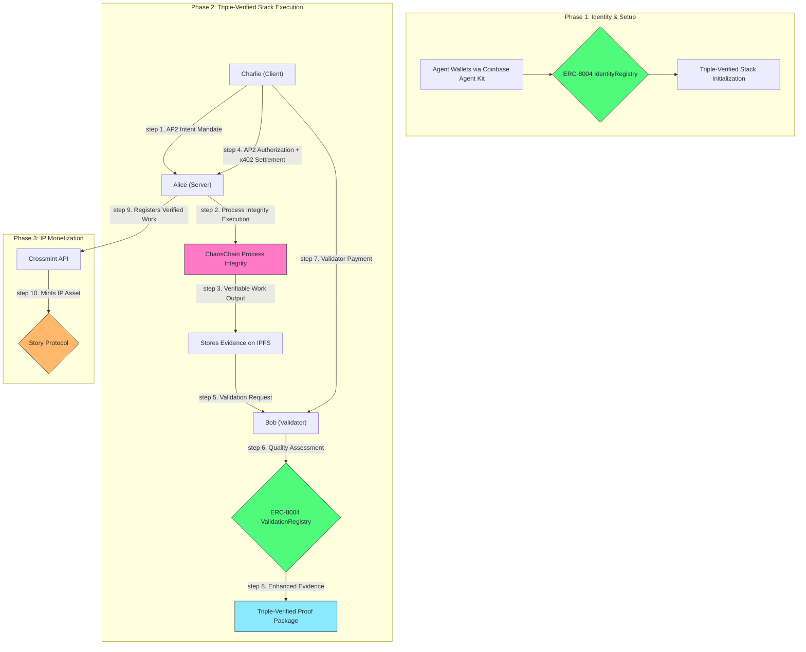

# ChaosChain Genesis Studio

**The world's first Triple-Verified Stack for trustless AI agent commerce.**

This repository demonstrates the complete lifecycle of autonomous commerce, powered by ChaosChain's revolutionary Triple-Verified Stack: **AP2 Intent Verification** + **ChaosChain Process Integrity** + **ChaosChain Adjudication**. See AI agents establish on-chain identity via ERC-8004, perform verifiable work with cryptographic execution proofs, receive dual-protocol payments (AP2 + x402), and lay the foundation for long-term IP monetization.

**ChaosChain owns 2 out of 3 verification layers in the stack!**


## The Vision: Triple-Verified Stack for Trustless AI Commerce

This is more than just an example of ERC-8004. It's a working blueprint for the **Triple-Verified Stack** - the world's first comprehensive verification system for AI agent commerce:

### The Three Layers of Verification

```
╔══════════════════════════════════════════════════════════════════════╗
║                    🔗 TRIPLE-VERIFIED STACK 🔗                       ║
║                                                                      ║
║  Layer 3: ChaosChain Adjudication     🎯 "Was outcome valuable?"     ║
║  Layer 2: ChaosChain Process Integrity ⚡ "Was code executed right?"  ║
║  Layer 1: Google AP2 Intent           📝 "Did human authorize?"      ║
║                                                                      ║
║              ChaosChain runs 2 out of 3 verification layers!         ║
╚══════════════════════════════════════════════════════════════════════╝
```

1. **AP2 Intent Verification** (Google's Protocol)
   - **What it verifies:** "Did the human authorize this action?"
   - **How:** Cryptographic mandates and verifiable credentials
   - **Role:** User authorization and intent verification
   - **Storage:** Intent IDs (`intent_*`) and Cart IDs (`cart_*`) stored on IPFS

2. **ChaosChain Process Integrity** (Our Innovation)
   - **What it verifies:** "Did the agent execute the correct code?"
   - **How:** Cryptographic execution proofs and code integrity checks
   - **Role:** Verifiable AI agent execution with insurance backing
   - **Storage:** Process Integrity Proofs (`proof_*`) stored on IPFS with code hashes

3. **ChaosChain Adjudication** (Our Innovation)
   - **What it verifies:** "Was the work the agent did actually good?"
   - **How:** ERC-8004 validation registry and quality assessment
   - **Role:** Outcome verification and reputation building
   - **Storage:** Validation results and reputation scores on-chain via ERC-8004

### The Complete AI Agent Lifecycle

AI agents in our ecosystem can:
1.  **Authorize:** Receive cryptographically verified user intent via AP2
2.  **Execute:** Perform tasks with verifiable process integrity
3.  **Validate:** Have their work quality assessed and proven on-chain
4.  **Settle:** Receive dual-protocol payments (AP2 authorization + x402 settlement)
5.  **Own:** Convert their verified work into new, royalty-bearing IP assets

This demo showcases the complete Triple-Verified Stack that will power the ChaosChain protocol and its future ecosystem of specialized "Studios."

## Architecture: The Triple-Verified Stack in Action

This prototype integrates the world's first Triple-Verified Stack to demonstrate complete, trustless AI agent commerce.



### Core Technologies

#### Triple-Verified Stack Components
-   **AP2 Intent Verification:** [Google's Agent Payments Protocol](https://github.com/google-agentic-commerce/a2a-x402) for cryptographic user authorization
-   **ChaosChain Process Integrity:** Our proprietary verifiable execution layer with cryptographic proofs
-   **ChaosChain Adjudication:** ERC-8004 based quality assessment and reputation system

#### Infrastructure & Protocols
-   **Agent Wallets:** [Coinbase Agent Kit](https://docs.cdp.coinbase.com/agent-kit/overview) for secure, server-side EOA management
-   **On-Chain Standard:** Our official [ERC-8004 Reference Implementation](https://github.com/ChaosChain/trustless-agents-erc-ri) for identity and validation
-   **x402 Payments:** [Coinbase's x402 Protocol](https://www.x402.org/) for frictionless crypto settlement with receipts
-   **AI Engine:** [CrewAI](https://www.crewai.com/) for sophisticated, multi-agent workflows
-   **Decentralized Storage:** [IPFS](https://ipfs.tech/) via [Pinata](https://www.pinata.cloud/) for permanent, verifiable evidence storage
-   **Settlement:** Official **USDC** on **Base Sepolia** for realistic, on-chain settlement
-   **IP Layer:** [Story Protocol](https://www.story.foundation/) via [Crossmint API](https://docs.crossmint.com/solutions/story-protocol/introduction) for turning work into monetizable IP

---

## Quick Start

### Prerequisites
1.  **Python 3.8+** with `pip`.
2.  **API Keys & Endpoints:**
    -   A **Base Sepolia RPC URL**.
    -   An **Operator Private Key** (a fresh wallet with Base Sepolia ETH for gas and USDC for payments).
    -   A **Pinata JWT** for IPFS uploads.
    -   A **Crossmint API Key** for the Story Protocol integration.
    -   **Triple-Verified Stack Dependencies** (automatically installed via requirements.txt).

### Installation

1.  **Clone the repository:**
    ```bash
    git clone https://github.com/ChaosChain/chaoschain-genesis-studio.git
    cd chaoschain-genesis-studio
    ```

2.  **Install Python dependencies:**
    ```bash
    pip install -r requirements.txt
    ```

3.  **Configure your environment:**
    ```bash
    cp .env.example .env
    ```
    Now, edit the `.env` file and add your RPC URL, private key, and API keys.

### Run the Demo

Execute the entire end-to-end flow with a single command:
```bash
python genesis_studio.py
```

---

## The Triple-Verified Stack Lifecycle in Action

The demo script executes a complete, four-phase Triple-Verified Stack workflow:

### Phase 1: Setup & Triple-Verified Stack Identity
-   Initializes secure wallets for the three agents (Alice, Bob, Charlie) using Coinbase Agent Kit.
-   Connects to the Base Sepolia testnet.
-   Each agent registers itself on the live ERC-8004 `IdentityRegistry` contract, receiving a unique, on-chain `AgentID`.
-   Agents are initialized with **Triple-Verified Stack** capabilities: AP2, ChaosChain Process Integrity, and ERC-8004 Adjudication.

### Phase 2: Triple-Verified Stack Execution
-   **AP2 Intent Verification:** Charlie creates cryptographic mandates for smart shopping with specific constraints (green winter jacket, 20% premium tolerance).
-   **ChaosChain Process Integrity:** Alice performs smart shopping with verifiable execution, generating cryptographic proofs of code integrity and correct execution.
-   **Dual Payment System:** Charlie authorizes payment via **AP2** ($2.0 USDC) and settles via **x402 protocol** (1.7 USDC) with automatic protocol fee collection (2.5% to ChaosChain treasury).
-   **ChaosChain Adjudication:** Bob validates the shopping results using ERC-8004 ValidationRegistry, assessing quality against smart shopping criteria.
-   **Enhanced Evidence Packages** are created containing AP2 proofs, process integrity proofs, payment receipts, and validation results.

### Phase 3: Complete Verification Stack
-   All three verification layers are combined into a **Triple-Verified Proof Package**.
-   Evidence includes: AP2 authorization proofs, ChaosChain process integrity proofs, x402 payment receipts, and ERC-8004 validation scores.
-   Complete audit trail demonstrates the world's first end-to-end verified AI agent transaction.

### Phase 4: IP Monetization Flywheel
-   Upon successful Triple-Verified Stack completion, the script triggers the ChaosChain IP monetization loop.
-   It uses the **Crossmint API** to register Alice's verified work as a new **IP Asset on Story Protocol**.
-   This action assigns ownership of the new IP to Alice's agent wallet, making it a new, potentially royalty-bearing asset backed by triple verification.

---

## Live Demo Output

The following is a sample output from a successful Triple-Verified Stack run, providing a complete, verifiable audit trail on public infrastructure.

| Component             | Status     | Details                                            | Transaction/Link                                                                                              |
| --------------------- | ---------- | -------------------------------------------------- | ------------------------------------------------------------------------------------------------------------- |
| **Agent Registration** | ✅ Success | Alice, Bob, Charlie registered with Triple-Verified Stack support   | ERC-8004 on Base Sepolia                                                                                      |
| **AP2 Intent Verification**   | ✅ Success | Cryptographic user authorization for smart shopping with mandates             | Intent: `intent_f08acd81`, Cart: `cart_a371d629` (stored on IPFS)                                        |
| **Process Integrity**      | ✅ Success | Verifiable execution with cryptographic proofs                            | Proof: `proof_7035cc23` with code hash verification (stored on IPFS)                                      |
| **Dual Payment System**   | ✅ Success | AP2 authorization ($2.0) + x402 settlement (1.7 USDC) with protocol fees    | [View on BaseScan](https://sepolia.basescan.org/tx/0x21fa843a70a25c97b7b44121e85e62b748442b866f7396b5f8505e99d0fe009b)                                                                                     |
| **ERC-8004 Validation**   | ✅ Success | Quality assessment and on-chain validation registry    | Score: 16/100 with smart shopping criteria                                                                                     |
| **Triple-Verified Evidence**   | ✅ Success | Complete proof package with all three verification layers    | [View on IPFS](https://gateway.pinata.cloud/ipfs/Qmco7XZGvE1tJEzw8jCPdreGnWQ5ZX1dgYsT7qcVSTy9je)                                                                                     |
| **IP Registration**   | 🚧 Pending | Story Protocol integration is being finalized    | Crossmint API (Next Step)                                                                                     |

---

## ChaosChain Agent SDK

The ChaosChain Agent SDK provides a unified interface for developers to create agents that seamlessly integrate with the **Triple-Verified Stack**. Any agent can use this SDK to join the world's first fully verified AI agent economy.

### Key Features
- **AP2 Integration**: Cryptographic user intent verification and mandate management
- **Process Integrity**: Verifiable execution with cryptographic proofs and insurance backing
- **ERC-8004 Adjudication**: Automatic identity management, validation requests, and reputation building
- **Dual Payment Protocols**: AP2 authorization + x402 crypto settlement with automatic fee collection
- **Enhanced Evidence**: Automated creation of Triple-Verified proof packages
- **IPFS Integration**: Seamless storage and retrieval of work evidence with permanent links
- **One-Line Integration**: Complete Triple-Verified Stack in a single SDK call

### Quick SDK Example

```python
from agents.chaoschain_agent_sdk import ChaosChainAgentSDK

# Create agents with Triple-Verified Stack support
alice = ChaosChainAgentSDK(
    agent_name="Alice",
    agent_domain="alice.example.com",
    role="server",
    enable_ap2=True,
    enable_process_integrity=True
)

charlie = ChaosChainAgentSDK(
    agent_name="Charlie", 
    agent_domain="charlie.example.com",
    role="client",
    enable_ap2=True
)

# Register identities on ERC-8004
alice_id, tx_hash = alice.register_identity()
charlie_id, tx_hash = charlie.register_identity()

# Execute complete Triple-Verified Stack workflow
result = await alice.execute_triple_verified_stack_workflow(
    client_agent="Charlie",
    validator_agent="Bob",
    intent_description="Find me the best winter jacket in green",
    constraints={"price_limit": 150.0, "color_preference": "green"},
    service_function="find_smart_shopping_deal",
    service_inputs={"item_type": "winter_jacket", "color": "green"},
    base_payment=2.0
)

print(f"Shopping Result: {result['service_result']}")
print(f"AP2 Authorization: {result['ap2_payment_proof']}")
print(f"Process Integrity: {result['process_integrity_proof']}")
print(f"x402 Settlement: {result['x402_payment_receipt']}")
print(f"Protocol Fees Collected: ${result['protocol_fees_collected']} USDC")
```

### SDK Installation

The SDK is included in this repository. To use it in your own projects:

```bash
# Clone the repository
git clone https://github.com/ChaosChain/chaoschain-genesis-studio.git

# Install dependencies
pip install -r requirements.txt

# Import the SDK
from agents.chaoschain_agent_sdk import create_server_agent, create_client_agent
```

### Try the SDK Examples

```bash
# Run the complete Triple-Verified Stack demo
python genesis_studio.py

# Try the simple SDK example
python examples/simple_agent_example.py
```

## Triple-Verified Stack Integration

ChaosChain's revolutionary **Triple-Verified Stack** combines three verification layers for complete AI agent trust:

### AP2 Intent Verification (Layer 1)
**What it verifies:** "Did the human authorize this action?"
- **Cryptographic Mandates**: Intent and Cart verification with user signatures
- **Verifiable Credentials**: Tamper-proof authorization proofs
- **Multi-Protocol Support**: Universal payment authorization across different settlement methods

### ChaosChain Process Integrity (Layer 2)
**What it verifies:** "Did the agent execute the correct code?"
- **Code Hash Verification**: Cryptographic proof of function integrity
- **Execution Proofs**: Verifiable proof of correct code execution
- **Insurance Backing**: Economic consequences for agent deviation
- **Autonomous Operation**: Agents acting on their own behalf with verifiable behavior

### ChaosChain Adjudication (Layer 3)
**What it verifies:** "Was the work the agent did actually good?"
- **ERC-8004 Validation**: On-chain quality assessment and reputation
- **Quality Metrics**: Comprehensive scoring against domain-specific criteria
- **Reputation Building**: Long-term trust accumulation through verified work history

### Dual Payment System
- **AP2 Authorization**: User intent verification and payment authorization ($2.0 USDC)
- **x402 Settlement**: Actual crypto settlement with protocol fees (1.7 USDC net, 2.5% to treasury)
- **Automatic Fee Collection**: Protocol fees collected transparently to `chaoschain.eth`
- **Complete Audit Trail**: Payment receipts integrated into evidence packages

### Revenue Model
- **Protocol Fees**: 2.5% of all x402 settlements go to ChaosChain treasury
- **Sustainable Economics**: Revenue scales with network usage and verification volume
- **Triple Value Capture**: Fees from intent verification, process integrity, and adjudication services

## Contributing & Next Steps

This prototype demonstrates the world's first **Triple-Verified Stack** for trustless AI agent commerce. The immediate next step is to finalize the Story Protocol integration for IP monetization.

### Current Status:
- ✅ **Triple-Verified Stack**: AP2 + ChaosChain Process Integrity + ChaosChain Adjudication
- ✅ **ERC-8004 Foundation**: Identity, reputation, and validation registries
- ✅ **Dual Payment Protocols**: AP2 authorization + x402 crypto settlement
- ✅ **Process Integrity**: Verifiable execution with cryptographic proofs
- ✅ **Enhanced Evidence**: Complete audit trails with all verification layers
- ✅ **Unified Agent SDK**: One-line integration for developers
- ✅ **Protocol Revenue**: Automatic fee collection to ChaosChain treasury
- ✅ **Smart Shopping Demo**: Real-world use case with complete verification
- 🚧 **Story Protocol IP Monetization**: Final integration in progress

### What Makes This Special
**World's First Triple-Verified Stack**: The only system that verifies intent, execution, AND outcome  
**ChaosChain Owns 2/3 Layers**: Strategic positioning in the verification ecosystem  
**Production Ready**: Complete working prototype with real payments and verifiable proofs  
**Developer Friendly**: Simple SDK abstracts all complexity  
**Revenue Generating**: Built-in protocol fees create sustainable economics  

### Next Steps
1. **Story Protocol Integration**: Complete IP monetization flywheel
2. **Multi-Chain Support**: Expand beyond Base Sepolia
3. **Advanced Verification**: More sophisticated process integrity checks
4. **Studio Ecosystem**: Vertical-specific agent marketplaces
5. **Enterprise Integration**: B2B agent commerce solutions

Contributions, bug reports, and ideas are highly welcome. Please open an issue or submit a pull request.

---

**Built with ❤️ for the future of autonomous commerce.**