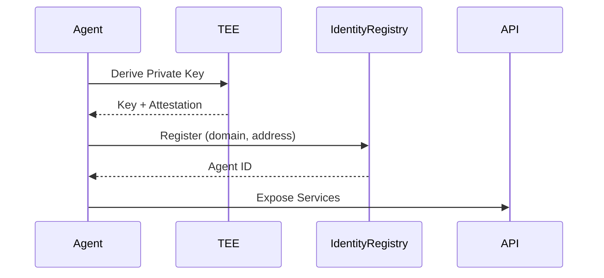
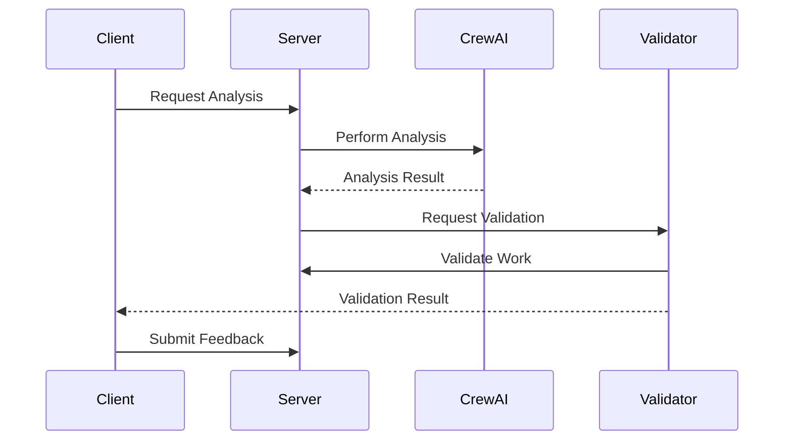

# Architecture Guide

## System Overview

The ERC-8004 Trustless Agents system implements a decentralized agent framework with TEE (Trusted Execution Environment) integration via Phala Cloud. The architecture enables autonomous agents to interact trustlessly through blockchain-based registries while maintaining privacy and security through TEE attestation.

## Core Components

### 1. Smart Contracts (ERC-8004 Registries)

Three core registry contracts manage agent interactions:

- **IdentityRegistry**: Agent registration and identity management
- **ReputationRegistry**: Feedback authorization and reputation tracking
- **ValidationRegistry**: Work validation request and response management

### 2. Agent Framework

#### Base Agents
- `ERC8004BaseAgent`: Standard agent implementation with Web3 integration
- `ERC8004TEEAgent`: TEE-enabled agent with secure key derivation

#### Specialized Agents
- **ServerAgent**: Provides market analysis services using CrewAI
- **ValidatorAgent**: Validates analysis work from server agents
- **ClientAgent**: Manages feedback and reputation interactions

### 3. TEE Integration (Phala Cloud)

TEE provides hardware-based security guarantees:

```python
# TEE Key Derivation Flow
TEE Client → get_key(path, purpose) → Deterministic Private Key
           → get_quote(data) → Attestation Quote
```

Key features:
- Deterministic key derivation from TEE
- Hardware attestation for trust verification
- Secure enclave execution environment

### 4. API Layer

FastAPI-based REST API with WebSocket support:

```
/agents         - Agent information and cards
/server/*       - Server agent operations
/validator/*    - Validator agent operations  
/client/*       - Client agent operations
/attestation/*  - TEE attestation endpoints
/workflow/*     - Complete workflow orchestration
/ws/*           - WebSocket real-time updates
```

## Data Flow

### Agent Registration Flow


### Analysis Workflow


## Security Model

### TEE Security
- **Key Isolation**: Private keys never leave TEE
- **Attestation**: Cryptographic proof of TEE execution
- **Deterministic Derivation**: Reproducible keys from salt

### Blockchain Security
- **On-chain Registries**: Immutable agent records
- **EIP-712 Signing**: Typed data signing for messages
- **Smart Contract Validation**: All interactions verified on-chain

### API Security
- **Bearer Token Authentication**: API access control
- **WebSocket Authentication**: Secure real-time channels
- **CORS Configuration**: Cross-origin security

## Deployment Architecture

### Local Development
```
Docker Compose
├── Anvil (Local Blockchain)
├── TEE Simulator (dstack)
├── API Server
└── Agent Services
```

### Phala Cloud Production
```
Phala CVM
├── TEE Environment
├── Agent Containers
├── API Gateway
└── Blockchain Connection
```

## Technology Stack

- **Blockchain**: Ethereum-compatible (Anvil local, any EVM production)
- **Smart Contracts**: Solidity with Foundry framework
- **TEE**: Phala Cloud with dstack SDK
- **Backend**: Python with FastAPI
- **AI/ML**: CrewAI for multi-agent orchestration
- **Containerization**: Docker with Flox environment
- **Testing**: Pytest with comprehensive test suites

## Scalability Considerations

1. **Agent Scaling**: Each agent runs independently
2. **API Scaling**: Horizontal scaling with load balancing
3. **TEE Scaling**: Multiple CVM instances on Phala Cloud
4. **Blockchain Scaling**: Layer 2 solutions compatible

## Future Enhancements

- [ ] IPFS integration for decentralized storage
- [ ] Multi-chain support
- [ ] Advanced reputation algorithms
- [ ] CrewAI Flows for complex workflows
- [ ] WebAssembly agent execution