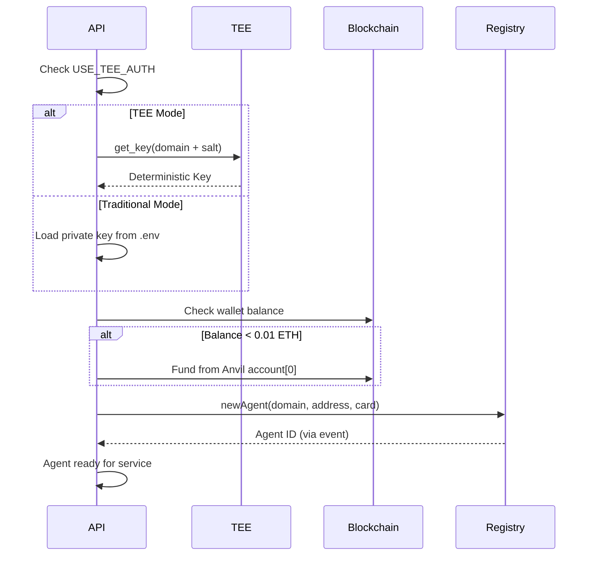
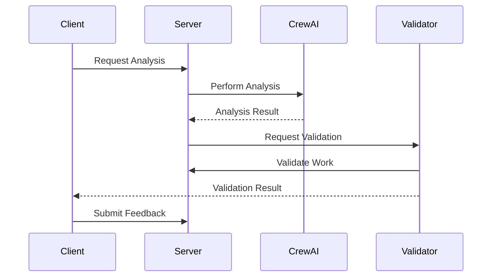

# Architecture Guide

## System Overview

The ERC-8004 Trustless Agents system implements a decentralized agent framework with Phala Cloud TEE (Trusted Execution Environment) integration. The architecture enables autonomous agents to interact trustlessly through blockchain-based registries while maintaining privacy and security through deterministic key derivation and optional TEE attestation.

### Key Features
- **Dual Mode Operation**: Supports both TEE-based (USE_TEE_AUTH=true) and traditional key-based authentication
- **Automatic Wallet Funding**: TEE agents are automatically funded during initialization
- **Deterministic Key Generation**: TEE mode derives keys from domain and salt combinations
- **ERC-8004 Compliance**: Full implementation of the trustless agent standard

## Core Components

### 1. Smart Contracts (ERC-8004 Registries)

Three core registry contracts manage agent interactions:

- **IdentityRegistry**: Agent registration and identity management
- **ReputationRegistry**: Feedback authorization and reputation tracking
- **ValidationRegistry**: Work validation request and response management

### 2. Agent Framework

#### Base Agents
- `ERC8004BaseAgent`: Standard agent implementation with Web3 integration
- `ERC8004TEEAgent`: TEE-enabled agent with deterministic key derivation

#### Specialized Agents (Support Both Modes)
- **ServerAgent/TEEServerAgent**: Market analysis services using CrewAI
  - Domain: `alice.example.com` (TEE mode)
  - Address: `0xC6aB3F953c7F0B33B1E9056Fa6f795B329c3323D` (TEE mode)
  
- **ValidatorAgent/TEEValidatorAgent**: Validates analysis work
  - Domain: `bob.example.com` (TEE mode)
  - Address: `0x83247F3B9772D2b0220A08b8fF01E95A28f7423F` (TEE mode)
  
- **ClientAgent/TEEClientAgent**: Manages feedback and reputation
  - Domain: `charlie.example.com` (TEE mode)
  - Address: `0x54AF215206E971ADE501373E0a6Ace7369B5c22d` (TEE mode)

### 3. TEE Integration (Phala Cloud)

TEE provides deterministic key generation and optional hardware security:

```python
# TEE Key Derivation Flow
Agent Domain + Salt → TEE Client → get_key(path) → Deterministic Private Key
                                 → Ethereum Address

# Example:
"alice.example.com" + "server-secret-salt-2024" 
    → 0xC6aB3F953c7F0B33B1E9056Fa6f795B329c3323D
```

Key features:
- **Deterministic Key Derivation**: Same domain+salt always produces same key
- **Automatic Funding**: TEE wallets funded automatically during setup
- **Optional Attestation**: Hardware attestation available for production
- **Development Mode**: TEE simulator for local testing

### 4. API Layer

FastAPI-based REST API with automatic agent initialization:

```
/health         - Health check with agent registration status
/agents         - Agent information with TEE/traditional mode
/server/*       - Server agent market analysis endpoints
/validator/*    - Validator agent validation endpoints  
/client/*       - Client agent feedback endpoints
/tee/status     - TEE configuration and wallet funding status
/tee/fund       - Manually trigger TEE wallet funding
/workflow/*     - Complete E2E workflow orchestration
/ws/*           - WebSocket real-time updates
```

**Auto-initialization on API startup:**
1. Detects TEE mode from USE_TEE_AUTH environment variable
2. Creates appropriate agent instances (TEE or traditional)
3. Funds wallets if balance < 0.01 ETH
4. Registers agents on blockchain
5. Exposes endpoints for interaction

## Data Flow

### Agent Registration Flow


### Analysis Workflow


## Security Model

### TEE Security
- **Key Isolation**: Private keys never leave TEE
- **Attestation**: Cryptographic proof of TEE execution
- **Deterministic Derivation**: Reproducible keys from salt

### Blockchain Security
- **On-chain Registries**: Immutable agent records
- **EIP-712 Signing**: Typed data signing for messages
- **Smart Contract Validation**: All interactions verified on-chain

### API Security
- **Bearer Token Authentication**: API access control
- **WebSocket Authentication**: Secure real-time channels
- **CORS Configuration**: Cross-origin security

## Deployment Architecture

### Local Development
```
Flox Environment (Required)
├── Anvil (Local Blockchain - make anvil)
├── TEE Simulator (Auto-started when USE_TEE_AUTH=true)
├── Contract Deployment (make deploy - includes funding)
├── API Server (python run_api.py)
└── Agent Services (Auto-initialized on API startup)
```

### Production Deployment Options

#### Phala Cloud TEE
```
Phala Network
├── TEE Hardware Environment
├── Deterministic Key Generation
├── Agent Containers
├── API Gateway
└── Blockchain Connection (Phala testnet/mainnet)
```

#### Traditional Cloud
```
Docker/Kubernetes
├── API Container
├── Agent Services
├── Private Key Management (Vault/KMS)
└── Blockchain Connection (Any EVM chain)
```

## Technology Stack

- **Environment Manager**: Flox (required for all operations)
- **Blockchain**: Ethereum-compatible (Anvil local, any EVM production)
- **Smart Contracts**: Solidity 0.8.19+ with Foundry framework
- **TEE**: Phala Cloud with dstack SDK (optional, based on USE_TEE_AUTH)
- **Backend**: Python 3.10+ with FastAPI
- **AI/ML**: CrewAI for multi-agent orchestration (optional)
- **Web3**: web3.py for blockchain interaction
- **Testing**: Pytest with unit, integration, and E2E tests
- **Key Management**: 
  - TEE mode: Deterministic derivation from domain+salt
  - Traditional: Private keys in environment variables

## Scalability Considerations

1. **Agent Scaling**: Each agent runs independently
2. **API Scaling**: Horizontal scaling with load balancing
3. **TEE Scaling**: Multiple CVM instances on Phala Cloud
4. **Blockchain Scaling**: Layer 2 solutions compatible

## Future Enhancements

- [ ] IPFS integration for decentralized storage
- [ ] Multi-chain support
- [ ] Advanced reputation algorithms
- [ ] CrewAI Flows for complex workflows
- [ ] WebAssembly agent execution