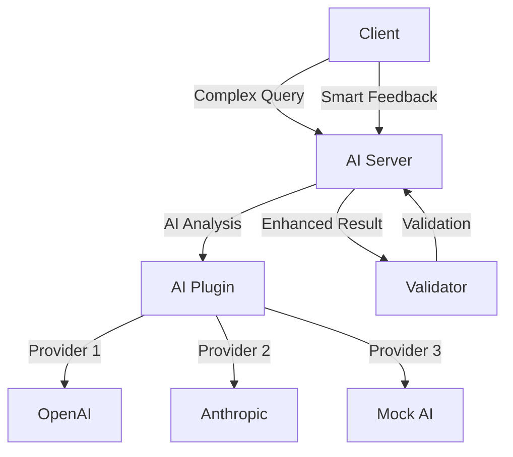

# AI-Enhanced Agent Example

This example demonstrates agents enhanced with AI capabilities using various LLM providers (OpenAI, Anthropic, Google, etc.) for intelligent task processing and decision making.

## Overview

The AI-enhanced workflow shows how to:
- Integrate AI capabilities into TEE agents
- Use multiple AI providers with fallback logic
- Perform intelligent analysis and decision making
- Boost confidence scores based on AI insights
- Create context-aware feedback systems

## Features

### AI Capabilities
- **Multi-Provider Support**: OpenAI, Anthropic, Google Gemini, Mistral, Cohere
- **Fallback Logic**: Automatic fallback to alternative providers
- **Mock AI Mode**: Demo mode without API keys
- **Plugin Architecture**: Modular AI components

### Enhanced Processing
- Complex query analysis
- Risk assessment
- Recommendation generation
- Confidence score boosting
- Context-aware responses

## Architecture



## Quick Start

### 1. Install Dependencies

```bash
cd examples/ai_enhanced
pip install -r ../../requirements.txt

# Install AI provider libraries (optional)
pip install openai anthropic google-generativeai mistralai cohere
```

### 2. Configure AI Providers

```bash
cp .env.example .env
# Edit .env and add your API keys for desired providers
```

Available providers:
- `OPENAI_API_KEY` - For GPT models
- `ANTHROPIC_API_KEY` - For Claude models
- `GOOGLE_API_KEY` - For Gemini models
- `MISTRAL_API_KEY` - For Mistral models
- `COHERE_API_KEY` - For Cohere models

### 3. Run the Demo

```bash
python run.py
```

## Expected Output

```
╔══════════════════════════════════════════╗
║  ERC-8004 TEE Agents - AI Enhanced      ║
║                                          ║
║  Intelligent Agents with AI/ML          ║
╚══════════════════════════════════════════╝

🚀 Setting up AI-Enhanced Agent Workflow
==================================================

🧠 Initializing AI-Enhanced Server Agent...
🧠 OpenAI capabilities enabled
🧠 Anthropic capabilities enabled
✅ All agents initialized!

==================================================
🎭 Starting AI-Enhanced Workflow
==================================================

📤 Step 1: Client requests complex analysis
✅ AI-Enhanced Server processed request
   Base confidence: 0.95
   AI Provider: openai
   AI Model: gpt-3.5-turbo
   Enhanced: True

   🔍 AI Insights:
      - Quantum computing poses long-term risks to current cryptography
      - Post-quantum cryptography standards are being developed

🔍 Step 2: Validate AI-enhanced results
✅ Validation complete: Valid

⭐ Step 3: Submit intelligent feedback
✅ Intelligent feedback submitted: Rating 5/5

📊 AI Workflow Summary
==================================================
{
  "workflow": "ai_enhanced",
  "enhancements": {
    "ai_provider": "openai",
    "ai_model": "gpt-3.5-turbo",
    "confidence_boost": 0.15
  },
  "results": {
    "ai_enhanced": true,
    "validation_passed": true,
    "final_rating": 5
  }
}
```

## Configuration

### AI Provider Priority

The system attempts providers in this order:
1. OpenAI (if configured)
2. Anthropic (if configured)
3. Google Gemini (if configured)
4. Mistral (if configured)
5. Cohere (if configured)
6. Mock AI (always available)

### Customizing AI Analysis

Modify the `AIAnalyzer` class to customize:
- Analysis prompts
- Model selection
- Temperature settings
- Token limits
- Response parsing

Example:
```python
class CustomAIAnalyzer(AIAnalyzer):
    async def analyze_with_openai(self, query, initial_result):
        # Custom prompt engineering
        prompt = f"Your custom prompt: {query}"

        # Custom model parameters
        response = await openai.ChatCompletion.create(
            model="gpt-4",  # Use GPT-4
            temperature=0.3,  # Lower temperature
            max_tokens=1000,  # More tokens
            messages=[...]
        )
```

## Plugin System

The AI capabilities are implemented as plugins:

```python
# Add custom AI plugin
class CustomAIPlugin:
    async def analyze(self, task_data, initial_result):
        # Your AI logic here
        return enhanced_result

agent.add_plugin('custom_ai', CustomAIPlugin())
```

## Production Deployment

### 1. Enable TEE Mode

```bash
USE_TEE_AUTH=true
SKIP_REGISTRATION=false
# Remove private keys
```

### 2. Configure Production AI Keys

Use environment variables or secret management:
```bash
export OPENAI_API_KEY="your-production-key"
export ANTHROPIC_API_KEY="your-production-key"
```

### 3. Deploy to Phala Cloud

```bash
cd ../..
./scripts/deploy_agent.py --config examples/ai_enhanced/.env
```

## Advanced Features

### Multi-Model Consensus

Combine results from multiple AI providers:
```python
results = await asyncio.gather(
    self.analyze_with_openai(query),
    self.analyze_with_anthropic(query),
    self.analyze_with_gemini(query)
)
consensus = self.build_consensus(results)
```

### Context-Aware Caching

Cache AI responses for similar queries:
```python
cache_key = hashlib.sha256(query.encode()).hexdigest()
if cache_key in self.ai_cache:
    return self.ai_cache[cache_key]
```

### Streaming Responses

For real-time AI interactions:
```python
async for chunk in openai.ChatCompletion.create_stream(...):
    yield chunk.choices[0].delta.content
```

## Troubleshooting

### No AI Enhancement

If AI features don't work:
1. Check API keys are set correctly
2. Verify provider libraries are installed
3. Check network connectivity
4. Review provider-specific errors in output

### Fallback to Mock AI

The system falls back to mock AI when:
- No API keys are configured
- Provider APIs are unavailable
- Rate limits are exceeded
- Errors occur during API calls

### Performance Issues

Optimize by:
- Caching frequent queries
- Using smaller models for simple tasks
- Implementing request batching
- Setting appropriate timeouts

## Customization Examples

### 1. Add New AI Provider

```python
async def analyze_with_custom_llm(self, query, initial_result):
    import custom_llm_sdk

    client = custom_llm_sdk.Client(api_key=os.getenv('CUSTOM_LLM_KEY'))
    response = await client.complete(prompt=query)

    return {
        "provider": "custom_llm",
        "model": "custom-model-v1",
        "analysis": response.text,
        "enhanced": True
    }
```

### 2. Specialized Analysis

```python
class SecurityAIAnalyzer(AIAnalyzer):
    async def analyze(self, task_data, initial_result):
        # Security-focused analysis
        if task_data.get('domain') == 'security':
            return await self.security_analysis(task_data)
        return await super().analyze(task_data, initial_result)
```

### 3. Multi-Stage Processing

```python
async def multi_stage_analysis(self, query):
    # Stage 1: Initial analysis
    stage1 = await self.analyze_with_openai(query)

    # Stage 2: Refinement
    refinement_prompt = f"Refine this analysis: {stage1}"
    stage2 = await self.analyze_with_anthropic(refinement_prompt)

    # Stage 3: Validation
    validation = await self.validate_analysis(stage2)

    return validation
```

## Next Steps

After exploring this AI-enhanced example:
1. Try different AI providers and models
2. Implement custom analysis logic
3. Build specialized AI plugins
4. Deploy production AI agents
5. Explore the custom_validation example