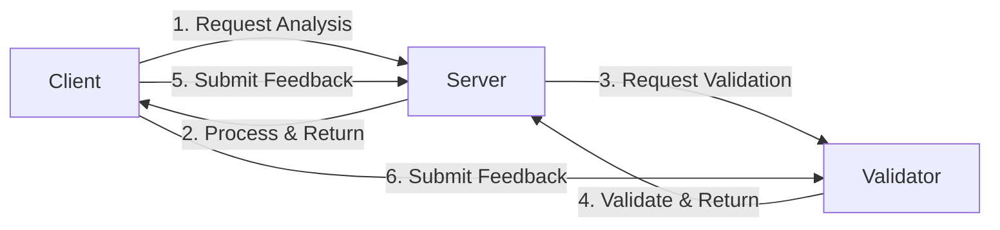

# Basic 3-Agent Workflow Example

This example demonstrates a complete workflow with three agents interacting through the ERC-8004 protocol.

## Overview

The workflow involves:
1. **Server Agent (Alice)** - Provides market analysis services
2. **Validator Agent (Bob)** - Validates analysis results
3. **Client Agent (Charlie)** - Requests services and provides feedback

## Workflow Steps



## Quick Start

### 1. Install Dependencies
```bash
cd examples/basic_workflow
pip install -r ../../requirements.txt
```

### 2. Configure Environment
```bash
cp .env.example .env
# Edit .env if needed
```

### 3. Run the Demo
```bash
python run.py
```

## Expected Output

```
🚀 Setting up 3-Agent Workflow Demo
==================================================

📊 Initializing Server Agent (Alice)...
✅ Server Agent initialized at domain: alice.example.com

🔍 Initializing Validator Agent (Bob)...
✅ Validator Agent initialized at domain: bob.example.com

📝 Initializing Client Agent (Charlie)...
✅ Client Agent initialized at domain: charlie.example.com

✅ All agents initialized successfully!

==================================================
🎭 Starting 3-Agent Workflow Demonstration
==================================================

📤 Step 1: Client requests market analysis from Server
✅ Server processed request: completed
   Analysis confidence: 0.85

🔍 Step 2: Server requests validation from Validator
✅ Validator processed request: completed
   Validation result: Valid
   Confidence: 1.0

⭐ Step 3: Client submits feedback for both agents
✅ Client submitted feedback for Server: Rating 5/5
✅ Client submitted feedback for Validator: Rating 5/5

📊 Workflow Summary
==================================================
{
  "workflow_id": "demo_workflow_001",
  "participants": {
    "server": "alice.example.com",
    "validator": "bob.example.com",
    "client": "charlie.example.com"
  },
  "steps_completed": [...],
  "results": {
    "analysis_status": "completed",
    "validation_status": true,
    "feedback_submitted": true
  }
}
```

## Configuration Options

### Demo Mode (Default)
- `USE_TEE_AUTH=false` - No TEE required
- `SKIP_REGISTRATION=true` - Skip blockchain registration
- Uses test private keys

### Production Mode
- `USE_TEE_AUTH=true` - Enable TEE authentication
- `SKIP_REGISTRATION=false` - Register agents on-chain
- Remove private keys (TEE derives them)

## Key Features Demonstrated

1. **Agent Initialization** - Creating agents with different roles
2. **Task Processing** - Server processes analysis requests
3. **Validation** - Validator verifies data integrity
4. **Feedback System** - Client rates service quality
5. **Async Operations** - All interactions are asynchronous

## Code Structure

- `run.py` - Main demonstration script
- `BasicWorkflowDemo` class - Orchestrates the workflow
- Three agent types from SDK templates

## Customization

You can modify the workflow by:
1. Changing the task types and data
2. Adding more agents
3. Implementing custom processing logic
4. Enabling TEE mode for production

## Troubleshooting

### Common Issues

1. **Import errors** - Ensure you're in the right directory and dependencies are installed
2. **Network errors** - Check RPC_URL is accessible
3. **TEE errors** - Ensure dstack simulator is running if USE_TEE_AUTH=true

### Debug Mode

Set environment variable for more output:
```bash
export DEBUG=true
python run.py
```

## Next Steps

After running this basic example, try:
1. The AI-enhanced example for intelligent agents
2. Custom validation example for specialized logic
3. Deploy to Phala Cloud for production use