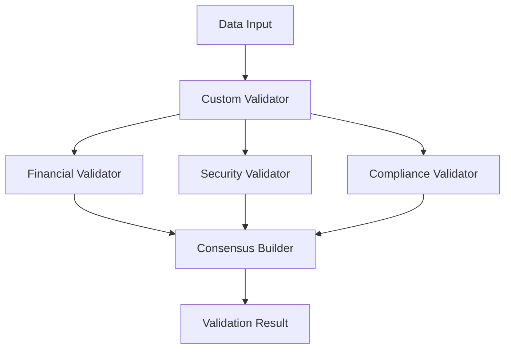

# Custom Validation Example

This example demonstrates specialized validation logic with domain-specific rules, multi-factor validation, and consensus mechanisms for TEE agents.

## Overview

The custom validation system shows how to:
- Implement domain-specific validation rules
- Create multi-factor validation pipelines
- Build consensus from multiple validators
- Apply different validation levels (low, medium, high, critical)
- Handle compliance and regulatory requirements

## Features

### Validation Types

1. **Financial Validator**
   - Amount validation and thresholds
   - Currency verification
   - Transaction rate limiting
   - Price deviation checks

2. **Security Validator**
   - Signature verification
   - Data integrity checks
   - Timestamp validation
   - Anomaly detection

3. **Compliance Validator**
   - GDPR compliance
   - KYC/AML checks
   - Data retention policies
   - License compliance

4. **Consensus Validator**
   - Aggregates multiple validator results
   - Calculates consensus scores
   - Identifies dissenting validators

## Architecture



## Quick Start

### 1. Install Dependencies

```bash
cd examples/custom_validation
pip install -r ../../requirements.txt
```

### 2. Configure Environment

```bash
cp .env.example .env
# Edit .env if needed
```

### 3. Run the Demo

```bash
python run.py
```

## Expected Output

```
╔══════════════════════════════════════════╗
║  ERC-8004 TEE Agents - Custom Validation║
║                                          ║
║  Domain-Specific Validation Rules       ║
╚══════════════════════════════════════════╝

🚀 Setting up Custom Validation Demo
==================================================

🔍 Initializing Custom Validator Agent...
✅ Custom Validator initialized!

==================================================
🎭 Custom Validation Scenarios
==================================================

📊 Scenario 1: Financial Transaction Validation
  Status: ✅ VALID
  Confidence: 1.00
  Validators Applied: financial, security
  Issues Found:
    - Price deviation: 5.00%

🔐 Scenario 2: Critical Security Validation
  Status: ✅ VALID
  Confidence: 0.75
  Validators Applied: security, consensus
  Consensus Score: 0.75

📋 Scenario 3: Compliance-Required Operation
  Status: ✅ VALID
  Confidence: 1.00
  Validators Applied: financial, security, compliance

❌ Scenario 4: Failed Validation Example
  Status: ❌ INVALID
  Confidence: 0.00
  Validators Applied: financial, security, compliance, consensus
  Issues Found:
    - Negative amount detected
    - Invalid currency: INVALID
    - Invalid signature

📊 Validation Summary
==================================================
{
  "scenarios_tested": 4,
  "validators_available": ["financial", "security", "compliance", "consensus"],
  "results": {
    "financial": true,
    "security": true,
    "compliance": true,
    "invalid": false
  }
}
```

## Validation Levels

### Low
- Basic checks only
- Fast processing
- Suitable for non-critical operations

### Medium (Default)
- Standard validation rules
- Balanced security/performance
- Most common operations

### High
- Enhanced security checks
- Stricter thresholds
- Important operations

### Critical
- All validators active
- Consensus required
- Maximum security
- Mission-critical operations

## Configuration

### Validation Rules

Customize validation rules in the validator classes:

```python
class FinancialDataValidator:
    # Adjust thresholds
    CRITICAL_AMOUNT_THRESHOLD = 1000000  # $1M
    MAX_TRANSACTION_RATE = 1000  # per hour
    MAX_PRICE_DEVIATION = 0.25  # 25%
```

### Adding Custom Validators

Create new validator plugins:

```python
class BlockchainValidator:
    async def validate(self, data, level):
        # Check blockchain-specific rules
        result = {
            'valid': True,
            'issues': [],
            'checks_performed': ['block_confirmation', 'gas_price']
        }

        if data.get('block_confirmations', 0) < 6:
            result['issues'].append('Insufficient confirmations')

        return result

# Add to validator
validator.add_plugin('blockchain', BlockchainValidator())
```

## Validation Scenarios

### 1. Financial Transaction

```python
data = {
    'type': 'financial',
    'validation_level': 'high',
    'amount': 50000,
    'currency': 'USD',
    'transaction_count': 50
}
result = await validator.validate_with_custom_rules(data)
```

### 2. Security-Critical Operation

```python
data = {
    'type': 'authentication',
    'validation_level': 'critical',
    'signature': '0x...',
    'timestamp': datetime.utcnow().isoformat()
}
result = await validator.validate_with_custom_rules(data)
```

### 3. Compliance-Required Process

```python
data = {
    'type': 'data_processing',
    'requires_compliance': True,
    'region': 'EU',
    'personal_data': True,
    'consent': True
}
result = await validator.validate_with_custom_rules(data)
```

## Advanced Features

### Consensus Building

The consensus validator aggregates results from multiple validators:

```python
# 2/3 majority required for critical operations
consensus_threshold = 0.66

# Calculate consensus score
consensus_score = valid_validators / total_validators

# Identify dissenting validators
if not all_agree:
    dissenting = find_dissenting_validators()
```

### Anomaly Detection

Detect unusual patterns in data:

```python
async def detect_anomalies(data):
    anomalies = []

    # Volume anomaly
    if data['request_count'] > historical_avg * 3:
        anomalies.append('Abnormal request volume')

    # Pattern anomaly
    if detect_bot_pattern(data['user_agent']):
        anomalies.append('Bot activity detected')

    return anomalies
```

### Compliance Checking

Automated regulatory compliance:

```python
# GDPR compliance
if region == 'EU':
    check_gdpr_requirements()

# KYC/AML for financial operations
if amount > threshold:
    verify_identity()
    verify_source_of_funds()
```

## Production Deployment

### 1. Enable TEE Mode

```bash
USE_TEE_AUTH=true
SKIP_REGISTRATION=false
# Remove private keys
```

### 2. Configure Validation Policies

Create `validation_policy.json`:

```json
{
  "default_level": "medium",
  "auto_escalate": true,
  "escalation_rules": {
    "amount_threshold": 100000,
    "risk_score_threshold": 75
  },
  "required_validators": {
    "financial": ["amount", "currency"],
    "security": ["signature", "timestamp"],
    "compliance": ["gdpr", "kyc"]
  }
}
```

### 3. Deploy Validator

```bash
cd ../..
./scripts/deploy_agent.py \
  --role validator \
  --config examples/custom_validation/.env \
  --policy validation_policy.json
```

## Integration with Other Agents

### Server Agent Integration

```python
class ServerWithValidation(ServerAgent):
    def __init__(self, config, registries):
        super().__init__(config, registries)
        self.validator = CustomValidatorAgent(...)

    async def process_task(self, task_data):
        # Process task
        result = await super().process_task(task_data)

        # Validate result
        validation = await self.validator.validate_with_custom_rules({
            'type': 'server_response',
            'data': result,
            'validation_level': 'high'
        })

        if not validation['overall_valid']:
            raise ValidationError(validation['issues'])

        return result
```

### Client Feedback Validation

```python
class ValidatedClientAgent(ClientAgent):
    async def submit_feedback(self, feedback_data):
        # Validate feedback before submission
        validation = await self.validator.validate_with_custom_rules({
            'type': 'feedback',
            'rating': feedback_data['rating'],
            'comment': feedback_data['comment']
        })

        if validation['overall_valid']:
            return await super().submit_feedback(feedback_data)
        else:
            return {'error': 'Invalid feedback', 'issues': validation['issues']}
```

## Troubleshooting

### Validation Failures

Common causes and solutions:

1. **Signature Invalid**
   - Check key format and encoding
   - Verify signature algorithm matches

2. **Timestamp Out of Range**
   - Ensure system time is synchronized
   - Check timezone handling

3. **Compliance Violations**
   - Review regional requirements
   - Ensure all required fields present

### Performance Issues

Optimize validation:

```python
# Cache validation results
@lru_cache(maxsize=1000)
def validate_cached(data_hash):
    return validate(data)

# Parallel validation
results = await asyncio.gather(
    financial_validator.validate(data),
    security_validator.validate(data),
    compliance_validator.validate(data)
)
```

## Customization Examples

### 1. Industry-Specific Validator

```python
class HealthcareValidator:
    """HIPAA compliance validator."""

    async def validate(self, data, level):
        # Check HIPAA requirements
        if not data.get('encryption_at_rest'):
            return {'valid': False, 'issues': ['HIPAA: No encryption at rest']}

        if not data.get('audit_logging'):
            return {'valid': False, 'issues': ['HIPAA: No audit logging']}

        return {'valid': True}
```

### 2. ML-Based Validator

```python
class MLValidator:
    """Machine learning fraud detection."""

    def __init__(self):
        self.model = load_fraud_detection_model()

    async def validate(self, data, level):
        features = extract_features(data)
        fraud_score = self.model.predict(features)

        if fraud_score > 0.8:
            return {'valid': False, 'issues': ['High fraud risk detected']}

        return {'valid': True, 'fraud_score': fraud_score}
```

### 3. Multi-Chain Validator

```python
class MultiChainValidator:
    """Cross-chain validation."""

    async def validate(self, data, level):
        # Validate across multiple blockchains
        eth_valid = await self.validate_ethereum(data)
        bsc_valid = await self.validate_bsc(data)

        return {
            'valid': eth_valid and bsc_valid,
            'chains_validated': ['ethereum', 'bsc']
        }
```

## Next Steps

After exploring custom validation:
1. Implement domain-specific validators
2. Create validation policies
3. Build consensus mechanisms
4. Deploy production validators
5. Monitor validation metrics